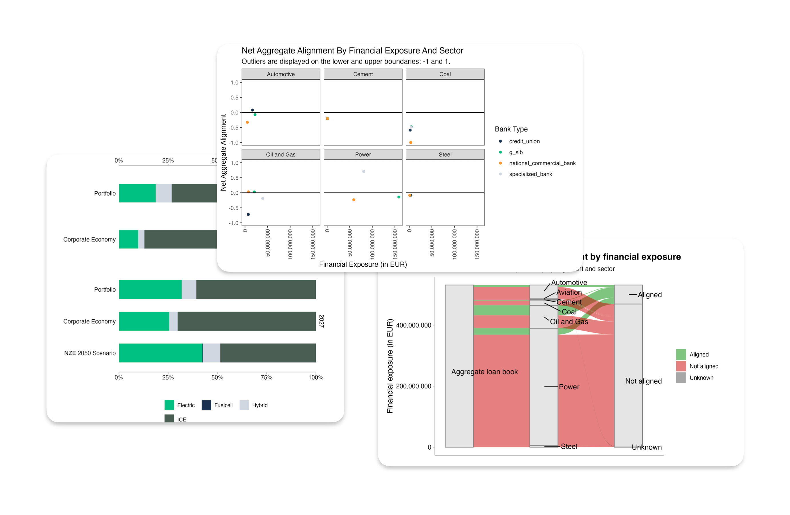

# pacta.multi.loanbook

[](https://www.repostatus.org/#unsupported)

**This project is archived for future reference, but no new work is
expected in this repository.**

The `pacta.multi.loanbook` package offers a standardized, user-friendly
way to calculate climate alignment metrics for multiple loan books,
based on the PACTA methodology.

Designed for financial supervisory contexts, it simplifies climate
alignment analysis across many lending institutions. The package
streamlines steps to prevent repetition while allowing flexibility to
tailor the analysis for specific project needs, providing valuable
insights into transition alignment and risk.



## Installation

You can install the release version of the package by running the
following command in R:

``` r
install.packages("pacta.multi.loanbook")
```

You can install the development version of the package from GitHub with:

``` r
# install.packages("pak")
pak::pak("RMI-PACTA/pacta.multi.loanbook")
```

## Usage

Please consult the following resource for instructions on using the
package. The cookbook provides a detailed overview covering the setup of
the necessary software environment, obtaining and preparing input data,
running the analysis, and interpreting the results.

- [Cookbook](https://rmi-pacta.github.io/pacta.multi.loanbook//articles/cookbook_overview.html):
  A comprehensive guide for setting up, running and interpreting the
  analysis.
