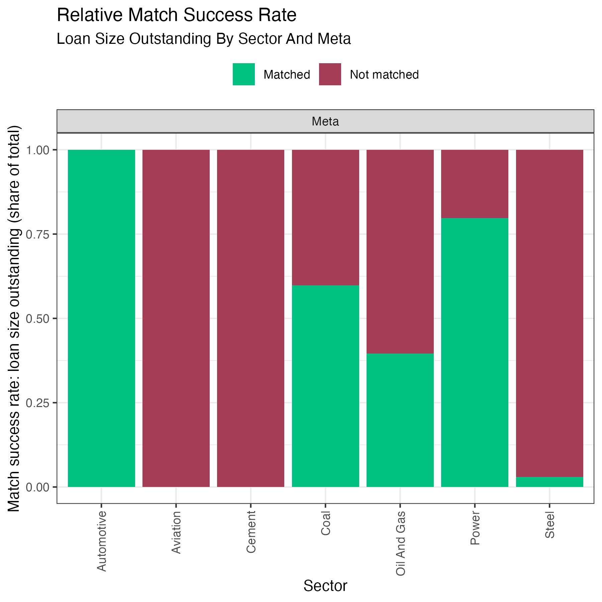
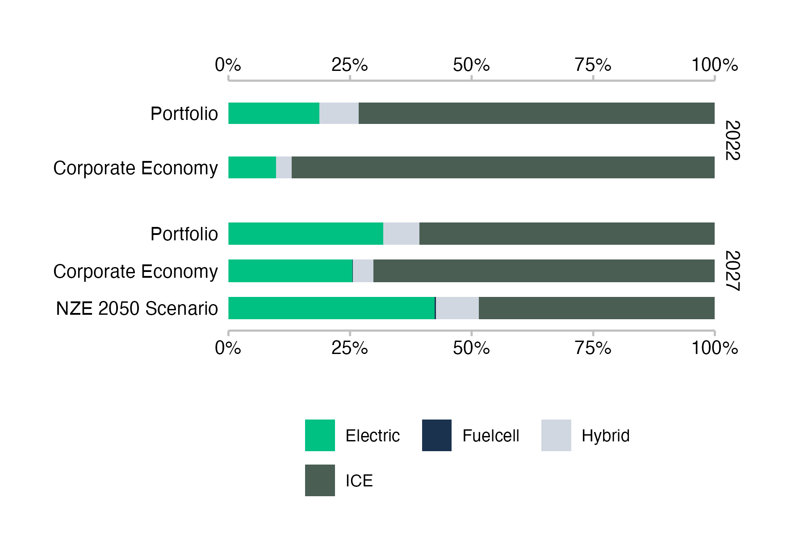
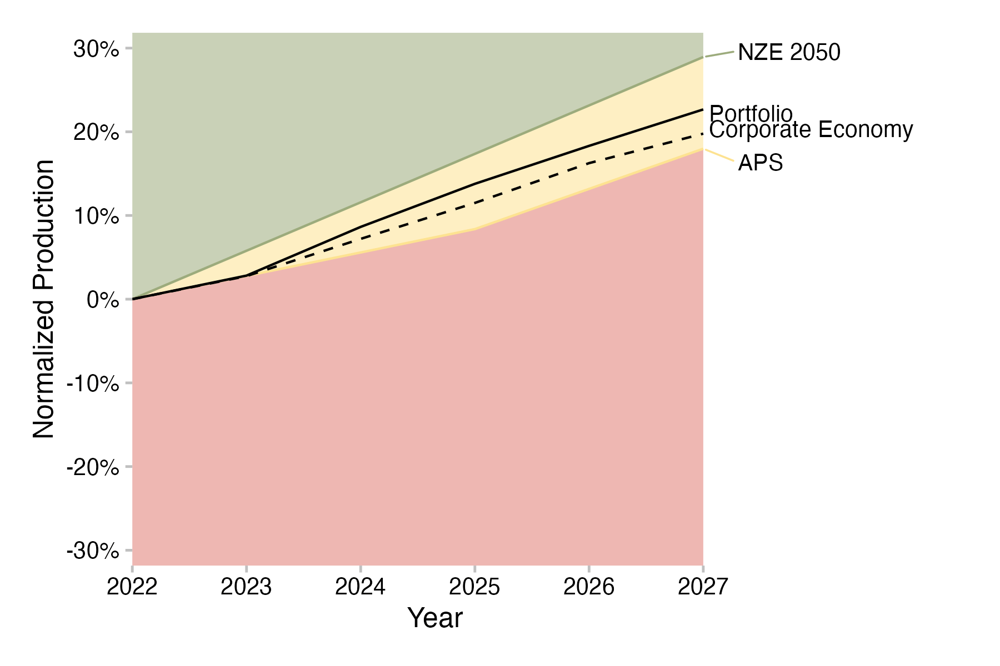
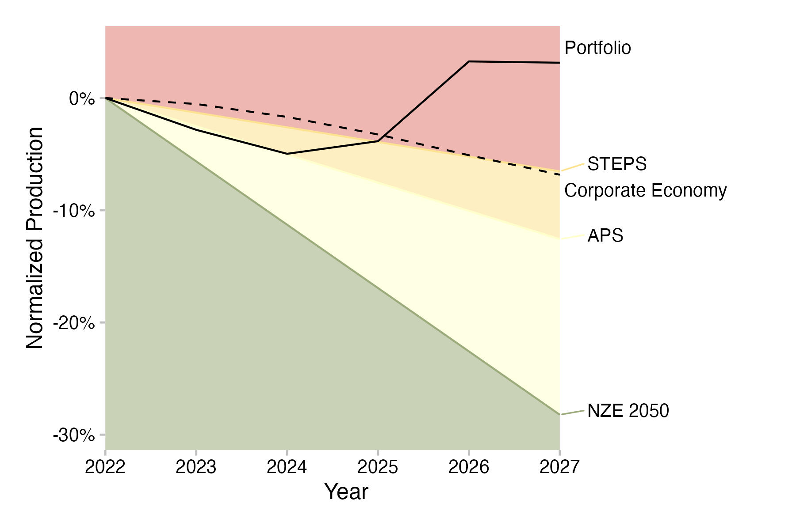
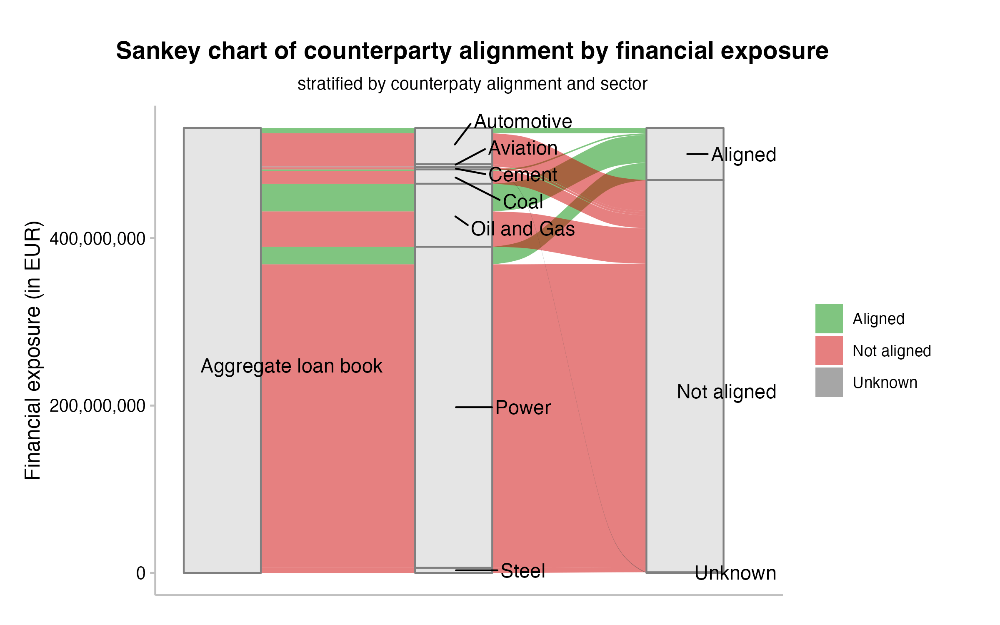
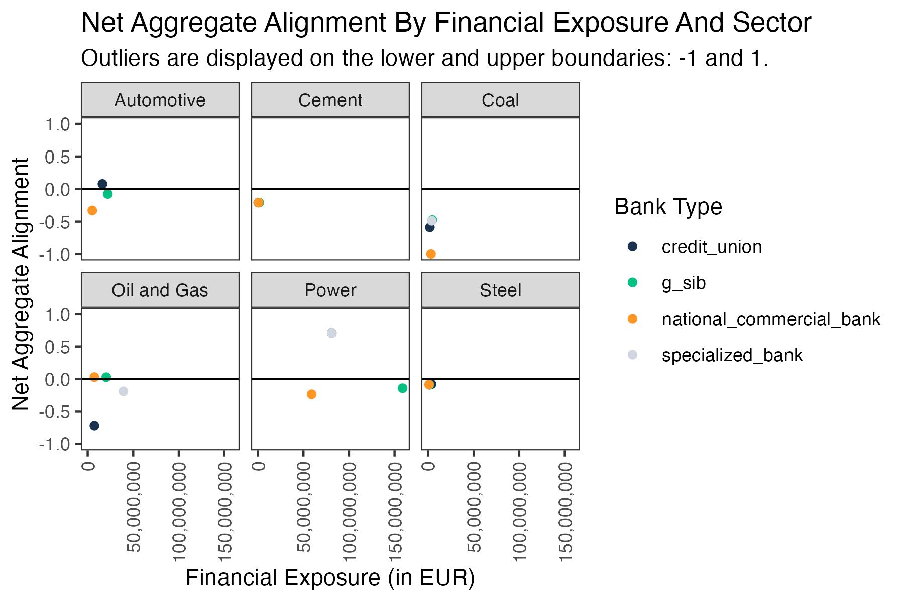

```{r, include = FALSE}
knitr::opts_chunk$set(
  collapse = TRUE,
  comment = "#>"
)
```

```{r setup, echo = FALSE}
library(pacta.multi.loanbook)

plot_table <- function(table) {
  table_plot <- gt::gt(dplyr::select(table, -"dataset"))
  
  table_plot <- 
    gt::cols_width(
      .data = table_plot,
      column ~ gt::px(150),
      typeof ~ gt::px(90)
    )
  
  table_plot <-
    gt::tab_style(
      data = table_plot,
      style = gt::cell_text(size = "smaller"),
      locations = gt::cells_body(columns = 1:2)
    )
  
  table_plot <-
    gt::tab_options(
      data = table_plot,
      ihtml.active = TRUE,
      ihtml.use_pagination = FALSE,
      ihtml.use_sorting = TRUE,
      ihtml.use_highlight = TRUE
    )
  
  gt::fmt_passthrough(table_plot)
}
```
# Overview

This cookbook provides a step-by-step guide to running the PACTA for Supervisors analysis using the `pacta.multi.loanbook` package. The analysis is designed to help financial supervisors assess the alignment of banks' loan books with the Paris Agreement goals.

## What is the PACTA for Supervisors analysis?

PACTA for Supervisors is based on the PACTA methodology, which assesses the alignment of financial portfolios with climate goals utilizing forward-looking asset-based company data (ABCD) that is linked to financial assets and compares the production profiles of those companies with technology and emissions pathways from climate transition scenarios at the sector and/or technology level.

## Who is this tool built for?

The PACTA for Supervisors analysis is primarily designed to be run by financial supervisors on their own, with minimal additional guidance. However, it can also be a useful tool for any other user, in case they would like to run a PACTA analysis on multiple loan books.

The main difference between this tool and the individual PACTA for Banks software packages is that this tool aims to facilitate the analysis of multiple loan books at once, streamlining the process as much as possible, to keep the burden for the user to a minimum. As such it is a helpful tool for anyone who would like to run a PACTA analysis on multiple loan books.

## What can the results of the PACTA for Supervisors analysis be used for?

Financial supervisors or regulators can use the results of the analysis to assess the alignment of banks' loan books with the Paris Agreement goals, to identify sectors where banks may need to take action to improve alignment, and to screen the financial system for potential climate-related transition risks. The analysis can be parameterised in different ways to explore patterns across the analysed loan books. If run by private institutions, the results may additionally be used to identify opportunities for climate-aligned investments, as well as for detecting individual counterparties that may be exposed to climate-related transition risks and may therefore require dedicated focus in the risk management process.

Users will be able to obtain both tabular outputs and plots that can be used for any of the above use cases. The tabular output further enables processing of the alignment results in other models or tools, for example as an input into financial risk models, or as a recurring input into internal monitoring systems.

The level of granularity of the outputs allows for a systematic analysis of climate alignment starting at the financial system level (across all analyzed loan books together), down to the individual counterparty level, and across sectors and technologies. Grouping of the results at any of these levels by additional dimensions can easily be achieved using the configuration file.

## What are the main steps of the analysis?

The main steps of the analysis are as follows:

1. Data preparation: Prepare the ABCD data and optionally a custom sector split.
2. Matching process: Match the raw loan books to the ABCD data.
3. Prioritization of loan books; Match success and coverage diagnostics: Prioritize the matched loan books and analyze their coverage.
4. Run PACTA for Supervisors analysis: Run the analysis based on the parameters set in the `config.yml` file.

This cookbook will guide you through each of the steps of the analysis in detail, explain the required input data sets and software, and provide guidance on how to interpret the results.

# Preparatory Steps

This section provides an overview of the preparatory steps that need to be taken before running the PACTA for Supervisors analysis. It includes information on the required input data sets, the required software, and the how to setup the project folder and file structure. Finally, it provides a checklist of the steps that need to be taken before running the analysis, summarizing in brief the steps explained in more detail before.

## Required Input Data Sets

The PACTA for Supervisors analysis requires a number of input data sets to run. Some of these can be obtained from external sources, while others need to be prepared by the user. Furthermore, some of the input data sets are optional and there inclusion will depend on the settings provided in the `config.yml` file. 

The main input data sets required for the analysis are the following:

### Asset-based Company Data (ABCD)

- required input
- external source
- XLSX file

This data set provides information on the production profiles and emission intensities of companies active in the following real economy sectors: Automotive (light-duty vehicles) manufacturing, aviation, cement production, coal mining, upstream oil & gas extraction, power generation, and steel production. The ABCD is typically obtained from third party data providers. However, it is possible to prepare the ABCD yourself or complement an external data set with entries that may not be covered out of the box.

The ABCD data set must be an XLSX file and contains the following columns:

```{r cols_abcd, echo = FALSE, results = 'asis'}
# TODO: should this be in the data dictionary?
cat(paste0("- `", pacta.multi.loanbook:::cols_abcd, "`", collapse = "\n"))
```

Further information on how to obtain ABCD for PACTA and documentation of the individual sectors and data points can be found here **LINK**.

### Scenario Data

- required input(s)
- external source
- CSV file(s)

The scenario data set provides information on the trajectories of technologies/fuel types and of emission intensities pathways for each of (or a subset of) the sectors covered in PACTA.

For sectors with technology level trajectories, the data set provides the TMSR and SMSP pathways based on the Market Share Approach, an allocation rule that implies all companies active in a sector have to adjust their production in a way that keeps market shares constant and solves for the aggregate climate transition scenario (**LINK** to the market share documentation).

The target market share scenario data set must be a CSV file and contains the following columns:

```{r cols_tms_scenario, echo = FALSE, results = 'asis'}
# TODO: should this be in the data dictionary?
cat(paste0("- `", names(pacta.multi.loanbook:::col_types_scenario_tms[["cols"]]), "`", collapse = "\n"))
```

For sectors that do not have technology level pathways, PACTA uses the Sectoral Decarbonization Approach (SDA), an allocation rule that implies that all companies in a sector have to converge their physical emission intensity at a future scenario value - e.g. in the year 2050. This implies that more polluting companies have to reduce their physical emissions intensity more drastically than companies using cleaner technology. It does not have any direct implications on the amount of units produced by any company (LINK to the SDA documentation).

The SDA scenario data set must be a CSV file and contains the following columns:

```{r cols_sda_scenario, echo = FALSE, results = 'asis'}
# TODO: should this be in the data dictionary?
cat(paste0("- `", names(pacta.multi.loanbook:::col_types_scenario_sda[["cols"]]), "`", collapse = "\n"))
```

While the raw input values of the scenarios are based on external third party organisations - such as the International Energy Agency (IEA), the Joint Research Center of the European Commission (JRC), or the Institute for Sustainable Futures (ISF) - the input data set for PACTA must be prepared using additional steps, which are documented publicly on the following GitHub repositories:

- [pacta.scenario.data.preparation](https://github.com/RMI-PACTA/pacta.scenario.data.preparation)
- [workflow.scenario.preparation](https://github.com/RMI-PACTA/workflow.scenario.preparation)

Since RMI has taken over stewardship of PACTA the prepared scenario files can also be accessed as CSV downloads the [PACTA website](https://pacta.rmi.org/pacta-for-banks-2020/) under the "Methodology and Documents" tab of the "PACTA for Banks" section. The files are usually updated annually based on the latest scenario publications.

### Raw Loan Books

- required input
- self-prepared
- CSV file(s)

The raw loan books are the financial data sets that you would like to analyze. They contain information on the loans that banks have provided to companies. As a supervisor, the data required to construct these data sets will typically be available to you through regulatory filings that are accessed via internal data bases or similar. As a bank, the data required will be available in your internal systems.

The raw loan books must be prepared as CSV files and contain at a minimum the following columns:

```{r cols_raw_loanbooks, echo = FALSE, results = 'asis'}
# TODO: should this be in the data dictionary?
cat(paste0("- `", names(pacta.multi.loanbook:::col_types_raw[["cols"]]), "`", collapse = "\n"))
```

**NOTE:** The tool will automatically add a column `group_id` to each of the loan books, which uses the file name as a value. This allows you to group the results the analysis by loan book, using the `by_group` parameter in the `config.yml` file. For any other variable that you may want to group the results by, you need to add a column to the raw loan book files that you then provide as the `by_group` parameter in the `config.yml` file.

For detailed descriptions of how to prepare raw loan books, see the [PACTA for Banks documentation](https://pacta.rmi.org/pacta-for-banks-2020/) and navigate to the "Training Materials" tab of the "PACTA for Banks" section. The *"User Guide 2"*, the *"Data Dictionary"*, and the *"Loan Book Template"* files can all be helpful in preparing your data.

**TODO:** check if the relevant documents are up to date

### Misclassified Loans

- optional input
- self-prepared
- CSV file

The user can provide a list of loans that have been misclassified in the raw loan books. The aim here is specifically to remove false positives, that is, loans that are classified in scope of one of the PACTA sectors, but where manual research shows that the companies do not actually operate within the PACTA scope. Such a false positive may be due to erroneous data entry in the raw loan book, for example. Removing these loans from the falsely indicated sector in the calculation of the match success rate will give a more accurate picture of what match success rate can really be reached.

### Asset-Based Company Data (ABCD) for company sector split

- optional input
- external source
- XLSX file

In case the user wants to split company exposures across sectors of in scope activity, the user must provide a version of the ABCD data set that follows the format of the Advanced Company Indicators data set by Asset Impact. This data set includes power generation values which are required for the primary energy based sector split.

### Companies to apply primary energy split on

- optional input
- self-prepared
- CSV file

When applying the sector split on company exposures, the user can provide a list of companies for which the sector split should be based on primary energy content. For all other companies, a simple equal weights split will be applied. For more information on the sector split, see the documentation in `vignette("sector_split")`.

### Manual Sector Classification

- optional input
- self-prepared
- CSV file

**TODO:** Add once we have a stable implementation of this feature

## Required Software

Using the `pacta.multi.loanbook` package for the PACTA for Supervisors analysis requires the following software to be installed on your system:

### R (version 4.1.0 or higher)

R is the programming language that the `pacta.multi.loanbook` package is written in. You can download R from the [Comprehensive R Archive Network (CRAN)](https://cran.r-project.org/).

### RStudio (optional)

RStudio is an integrated development environment (IDE) for R developed by Posit. It is not strictly required to run the analysis, but it can be helpful for managing your project and running the analysis. Generally, RStudio is very widely used among the R cummunity and probably the easiest way to interact with most R tools, such as `pacta.multi.loanbook`. RStudio Desktop is an open source tool and free of charge. You can download RStudio from the [Posit RStudio website](https://posit.co/downloads/).

### `pacta.multi.loanbook` R package

The `pacta.multi.loanbook` package is the main software tool that you will use to run the PACTA for Supervisors analysis.

::: {.pkgdown-release}
You can install the package from the [RStudio CRAN mirror](https://cran.r-project.org/web/packages/pacta.multi.loanbook/index.html) by running the following command in R:

``` r
install.packages("pacta.multi.loanbook")
```

You can install the development version of pkgdown from GitHub with:

``` r
pak::pak("r-lib/pkgdown")
```
:::

::: {.pkgdown-devel}
You can install the development version of pkgdown from GitHub with:

``` r
pak::pak("r-lib/pkgdown")
```
:::

### Required R packages

The `pacta.multi.loanbook` package depends on a number of other R packages. These dependencies will be installed automatically when you install the `pacta.multi.loanbook` package. The required packages are:

```{r imports, echo = FALSE, results = 'asis'}
cat(utils::packageDescription("pacta.multi.loanbook")[["Imports"]])
```

### Suggested R packages

The suggested packages are not required to run the analysis, but they are used in the examples and vignettes provided with the package:

```{r suggests, echo = FALSE, results = 'asis'}
cat(utils::packageDescription("pacta.multi.loanbook")[["Suggests"]])
```

### FAQ

#### How do I install the `pacta.multi.loanbook` package?

The most common ways to install R packages are via CRAN or GitHub. Public institutions often have restrictions on the installation of packages from GitHub, so you may need to install the package from CRAN. In some cases, your institution may mirror CRAN in their internal application registry, so you may need to install the package from there. Should you have any issues with the installation from the internal application registry, it is best to reach out to your IT department. If you cannot obtain the package any of these ways, please reach out to the package maintainers directly for exploring other options.

#### How do I install the required R packages?

In principle, all dependencies required to run the `pacta.multi.loanbook` package will be installed automatically when you install the package. However, if you encounter any issues with the installation of the required packages, you can install them manually by running the following command in R, where ... should be replaced with the package names from the list above, separated by commas:

```{r install_deps, eval = FALSE}
install.packages(c(...))
```

## Project Setup

### Config

All of the functions needed to run a PACTA for Supervisors analysis take a `config` argument, which can either be a path to a `config.yml` file (see `vignette("config_yml")`) or a config list object containing previously imported settings from a `config.yml` file. All of the settings/options are configured with this `config.yml` file.

### Input/Output folder structure

The `config.yml` file then points to an input directory and to four output directories, one for each user-facing function, that the user can choose anywhere on their system, as long as R has read and write access to these directories. A recommendable choice to structure an analysis project would be to place all these folders and the `config.yml` file in a project folder. The input folder must contain all input files as described above, with the raw loan books being placed in a sub-directory that must be named `"loanbooks"`. The output folders will automatically be created at the locations indicated in the `config.yml` file. They will be populated by running the analysis. **NOTE:** Re-running a step of the analysis will replace the entire corresponding output directory, if the directory already exists.

An example of how the project folder could be structured:

```
project_folder
├── config.yml
├── input
│   ├── ABCD.xlsx
│   ├── loanbooks
│   │   ├── raw_loanbook_1.csv
│   │   ├── raw_loanbook_2.csv
│   │   └── ...
│   ├── scenario_data_tms.csv
│   ├── scenario_data_sda.csv
│   └── ...
├── prepared_abcd
├── matched_loanbooks
├── prioritized_loanbooks_and_diagnostics
└── analysis
```

Notice that the names of the directories can be changed to something the user may prefer. The names were chosen for illustrative purposes to reflect the corresponding user-facing functions that create the outputs.

## Checklist of Preparatory Steps

Before running the PACTA for Supervisors analysis, you should make sure that you have completed the following preparatory steps:

- [ ] Obtained the required external input data sets:
  - [ ] Asset-based Company Data (ABCD)
  - [ ] Scenario Data
- [ ] Prepared the required input data sets:
  - [ ] Raw Loan Books
- [ ] OPTIONAL - Obtained the optional external input data sets:
  - [ ] Asset-based Company Data (ABCD) for company sector split
- [ ] OPTIONAL - Prepared the optional input data sets:
  - [ ] Companies to apply primary energy split on
  - [ ] Misclassified Loans
  - [ ] Manual Sector Classification
- [ ] Installed the required software:
  - [ ] R (version 4.1.0 or higher)
  - [ ] RStudio (optional)
  - [ ] `pacta.multi.loanbook` R package
- [ ] Installed the required R packages:
  - [ ] `pacta.multi.loanbook` dependencies
- [ ] OPTIONAL - Installed the suggested R packages:
  - [ ] `pacta.multi.loanbook` suggests
- [ ] Setup the project folder and file structure:
  - [ ] Created a project folder
  - [ ] Created a `config.yml` file and placed it in the project folder
  - [ ] Created an `input` folder in the project folder
  - [ ] Placed the raw loan books in the `input/loanbooks` sub-directory
  - [ ] Placed the other input data sets in the `input` folder
  - [ ] Created appropriate values for all input and ouput directories in the `config.yml` file


# Running the Analysis

This section provides a step-by-step guide to running the PACTA for Supervisors analysis using the `pacta.multi.loanbook` package. It includes information on the structure of the workflow, the required functions, and the interpretation of the results.

## Structure of the Workflow

The PACTA for Supervisors analysis consists of four main steps:

- Data preparation: Preparing the input data sets for the requirements of the analysis.
- Matching process: Matching the raw loan books to the ABCD data and validating the matches manually.
- Prioritization of loan books: Selecting the correct matches for further analysis and diagnosing match success and coverage statistics
- Run PACTA for Supervisors analysis: Running the analysis based on the parameters set in the `config.yml` file to generate the production-based alignment analysis.

The following diagram illustrates the structure of the workflow:

```{r workflow_structure, echo=FALSE, fig.cap='Fig. 1: Structure of the Workflow', fig.align='center', out.width=200}
knitr::include_graphics("../man/figures/p4s_workflow_structure.png")
```

As the diagram shows, there is a logical sequence to how to run the functions. For any of the functions to work, the previous functions must have been run already and their outputs must be accessible as inputs to the next functions. If you want to keep different versions of the calculations, i.e. you want to avoid overwriting past outputs, you will have to (1) ensure that each run is done with a new value for the corresponding output directory set in the `config.yml` and (2) that the relevant function refers to the appropriate directories of upstream outputs. For example, if you want to run the analysis twice and keep both results, all `dir_*` entries of the `config.yml` should remain identical for both runs, except for the `dir_analysis` entry, which should be different for each run.

The following sub sections will provide detailed information on each of the steps of the analysis, starting with a brief explanation of the setup, as each of the functions will require the path to the `config.yml` file as an input argument.

## Setup

If you run PACTA for Supervisors interactively or from a script you may have prepared, you will likely want to load the `pacta.multi.loanbook` package and save the path to the `config.yml` file in a variable first:

```r
library(pacta.multi.loanbook)
config_path <- "config.yml"
```

This allows you passing the relevant config information easily to each of the four main functions.

## Data preparation

The first step of the analysis is to prepare your input data sets for the requirements of the analysis. Your ABCD data will need to be prepared and you can optionally use a custom sector split, that will also need to be prepared. The relevant function is `prepare_abcd()`, which takes configurations from the `config.yml` that you have prepared. The function will store intermediary files in the directory that you have indicated as the value corresponding to the key `dir_prepared_abcd` in the `config.yml`. This step only has to be run once for an analysis. You can run this function as follows:

```r
pacta.multi.loanbook::prepare_abcd(config_path)
```

### Options for the `prepare_abcd()` function

The `prepare_abcd()` function has a number of options that can be set in the `config.yml` file. These options include:

- whether or not inactive companies should be removed from the ABCD data (For more information on the options available, see the [relevant section on preparing the ABCD](https://rmi-pacta.github.io/pacta.multi.loanbook/articles/config_yml.html#prepare_abcd) in the `vignette("config_yml")`.)
- if and how a company sector split should be applied in the calculations (For more information on the options available, see the [relevant section on the sector split](https://rmi-pacta.github.io/pacta.multi.loanbook/articles/config_yml.html#sector_split) in the `vignette("config_yml")`). Additionally, see the documentation of the sector split methodology in `vignette("sector_split")`.

If you want to use the sector split, you can specify which company identifiers the split should be applied on by providing a CSV file with the company identifiers in the `split_company_ids.csv` file in the input directory. The file should contain the columns `company_id` and `name_company` to identify the relevant companies.

## Matching process

The next step in the analysis is to run the matching process. Assuming you have prepared the raw loan books as explained in [the section on preparing the input data sets](### Raw Loan Books), you can now use the `match_loanbooks()` function. This will read the raw loan books from your inputs and attempt to match them to the prepared ABCD data from the previous step. The function will store matched loan book files in a directory that you have indicated as the value corresponding to the key `dir_matched_loanbooks` in the `config.yml`. You can run this function as follows:

```r
pacta.multi.loanbook::match_loanbooks(config_path)
```

After the matching process is complete, you will need to do some manual matching. This means that you will need to manually inspect the suggested matches that the tool has found and decide which ones to keep or to remove. This is especially important when using text based matching, as there is no guarantee that similar company names as identified by the algorithms will actually refer to the same companies in the raw loan books and the ABCD. Thus, a manually validation step is crucial in the analysis, as the quality of the matches will determine the quality of the results of any further calculations.

The manual matching process is not automated and will require some time and effort on your part. You can find the matched loan books in the `.../matched_loanbooks` folder. The matched loan books will be stored in CSV files, one for each raw loan book. You can open these files in a spreadsheet program to verify the matches. Importantly, you will need to make a copy for each of the matched loan book files in the same `.../matched_loanbooks` folder and rename that copy by adding the suffix `_manual` to the file name. The following steps of the analysis expect this pattern, so it is important to follow this naming convention.

You can find more detailed information about the matching process in the training material on the [PACTA for Banks website](https://pacta.rmi.org/pacta-for-banks-2020/) in the section "PACTA for Banks Training Webinar 2" and in the [corresponding slide deck](https://pacta.rmi.org/wp-content/uploads/2020/12/PACTA-for-Banks-Training-Webinar-2-Matching-a-loan-book-to-physical-assets-in-the-real-economy-.pdf).

### Some expectations for the matching process

- It is unlikely that you will be able to match all of the loans from your raw loan books to the ABCD data set. This is expected and has the following reasons:
  - Raw loan books often include companies that are not in scope of the PACTA analysis, for example there may be companies active in the financial sector or in manufacturing of IT products. Both these sectors are fully out of scope. There may also be companies that are active in upstream or downstream activities of the sectors covered by PACTA. This means that the company activities are not at the part of the value chain that is covered my PACTA and accordingly the companies are not matched. Examples for this are power distribution companies or companies that manufacture air crafts.
  - The ABCD data set may not cover all companies that are in scope of the PACTA analysis. While coverage of the real economy sectors is usually rather high in the data sets that are commonly used for PACTA, there are gaps. This implies that some in-scope companies cannot be matched because the ABCD data set does not include them. Advanced users may research the production profiles of such companies by themselves and add them to the ABCD data manually, however this is a very involved process and not standard procedure and will therefore not be covered in this cookbook.
  - If you are using sector classifications for the matching process (which is recommended whenever possible), some matches may not be identified in case the companies in the raw loan book are misclassified. For example, if a utility that is focused on coal-fired power generation is classified as a coal mining company, the matching function will not suggest a match.
- Given that it is unlikely to match all loans, it is recommended to try and match the companies with the largest financial exposures first, as this ensures the best possible financial coverage of the loan book in the analysis.
- It is also recommended to run multiple iterations of the matching process, potentially adjusting the matching parameters in the `config.yml` file, to see if you can improve the match success rate. The match success rate can be obtained based on the manually validated matched loan books and the raw loan books as described in [the next section on prioritization and diagnostics](### Prioritization of loan books; Match success and coverage diagnostics).

### Options for the `match_loanbooks()` function

The `match_loanbooks()` function has a number of options that can be set in the `config.yml` file. These options include:

- specifications for the approach to matching the raw loan book with the ABCD [relevant section on matching](https://rmi-pacta.github.io/pacta.multi.loanbook/articles/config_yml.html#matching) in the `vignette("config_yml")`). Note that these parameters are all based on the `r2dii.match::match_name` function and pass the parameters directly to that function. For more information on the options available, see the [documentation of the r2dii.match package](https://rmi-pacta.github.io/r2dii.match/reference/match_name.html). This also covers matching based on unique identifiers, which is the most reliable way to match companies, but requires that both the raw loan books and the ABCD contain such identifiers.
- whether to use a manually prepared sector classification system for matching the loan books to in-scope PACTA sectors, see the [relevant section on matching](https://rmi-pacta.github.io/pacta.multi.loanbook/articles/config_yml.html#matching) in the `vignette("config_yml")`), or not. If not, the sector classification systems provided in `r2dii.data::sector_classifications` can be used.
 
### Addressing misclassfied loans

There are two ways to appropriately handle misclassified loans that are identified as in-scope in the raw data set but are then not matched.

1. Correct the classification in the raw loan book and re-run the matching process. If the loan was clearly mis-classified, this may be the most appropriate way to handle the issue. It may be a good idea to record any such changes made in the input data though. The upsdie of this approach is that the loan will now either be matched correctly, as it will be assigned the sector that the company should have and therefore find an entry in the ABCD data set to match against. Or, if there is still no match to be found in the ABCD, the loan will correctly be missing in the appropriate sector and therefore indicate a lower match success rate where it should.
2. If a manual re-classification of the raw loan book is not possible or desired, the calculation of the match success rate can be corrected by adding a file `loans_to_remove.csv` to the input directory. This file should include the columns `id_loan` and `group_id` to indicate the precise mis-classified loan and the loan book in which it was found. This combination of loan and loan book will then be excluded from the match success calculation.

The reason why it is a good idea to either correct mis-classified loans or disregard them in the calculation of the match success rate is that a mis-classified loan cannot possibly be matched in a given sector. Therefore, no amount of work would be sufficient to improve the sector match success rate, because it is calculated against an incorrect baseline. Technically, the user is not forced to correct misclassifications, and there may be a limit to how much time should be spent on this, but it is recommended to at least correct large mis-classified loans.

### Sector split

If you want to apply the sector split to the loan books, you should keep all relevant sectors in the matched loan book, instead of only one sector. This is because the sector split will be applied to the matched loan books, and the sector split will be based on the sectors in the matched loan books. If you only keep one sector in the matched loan books, the sector split will not be applied correctly and may wrongly appear to reduce overall matched financial exposure. The sector split will be applied to the matched loan books in the next step of the analysis.

## Prioritization of loan books; Match success and coverage diagnostics

The next step is to prioritize the manually verified matched loan books and analyze their coverage, both relative to the raw loan book inputs (the "match success rate") and to the production capacity in the wider economy (the "loan book production coverage"). Prioritizing the loan books means that you will only keep the best identified match for each loan and use that in the following steps of the analysis.

You will probably want to check the status of your loan book and production coverage several times, as it is rare to get to the desired level of matching in one iteration. This means you may want to repeat the previous step (matching the loan books, likely using different parameters for different iterations) and this step (prioritizing the matched loan books and analyzing their match success rate) a number of times to reach the best possible outcome. To prioritize your matched loan books and calculate display the coverage diagnostics, you will use the `prioritise_and_diagnose()` function. This call will store matched prioritized loan book files and coverage diagnostics in a directory that you have indicated as the value corresponding to the key `dir_prioritized_loanbooks_and_diagnostics` in the `config.yml`. You can then run the function as follows:

```r
pacta.multi.loanbook::prioritise_and_diagnose(config_path)
```

### Options for the `prioritise_and_diagnose()` function

The `prioritise_and_diagnose()` function has a number of options that can be set in the `config.yml` file. These options include:

- the option to set a specific order for prioritizing the matches. This is an option that is passed directly to the `r2dii.match::prioritize` function. `NULL` is a valid default value and is usually a setting that works well, at least as a starting point. For more information, see the [relevant section on the prioritization of matched loan books](https://rmi-pacta.github.io/pacta.multi.loanbook/articles/config_yml.html#match_prioritize) in the `vignette("config_yml")` or the [documentation of the r2dii.match::prioritize() function here](https://rmi-pacta.github.io/r2dii.match/reference/prioritize.html).


## Run PACTA for Supervisors analysis

The final step is running the analysis based on the parameters you have set in the `config.yml` file. This entails both a standard PACTA for Banks analysis and the calculation of the net aggregate alignment metric. For both parts of the analysis, outputs will be stored in the sub-directories `../standard/` (for standard PACTA for Banks results) and `../aggregated/` for the net aggregate alignment metric directory - below the directory that you have indicated as the value corresponding to the key `dir_analysis` in the `config.yml`. Outputs in these sub directories will comprise tabular outputs and plots. To run the analysis on all of your previously matched and prioritized loan books, you will use the `analyse()` function as follows:

```r
pacta.multi.loanbook::analyse(config_path)
```

### Options for the `analysis()` function and the overall analysis

The `analysis()` function has a number of options that can be set in the `config.yml` file. These options include:

- which source should be used for allocating climate transition scenario pathways to the companies and loan books. This refers to the relevant scenario publication and usually contains the name and the year of the publication, e.g.: `"weo_2023"` or `"geco_2023"`.
- which scenario should be used for reference in the net aggregate alignment metric. This must be a scenario that is included in the source indicated above.
- which region to use as a reference for the analysis. This will filter the underlying production capacity to assets in the relevant region and will measure alignment against the scenario trajectory for the relevant region. It must therefore be a region, for which scenario data is available in the source selected above.
- the start year of the analysis. This must be a year that is available both in the ABCD data and for which the scenario data has been prepared. The loan book data is assumed to be a snapshot of the end of the same year.
- the time frame of the analysis, which refers to the number of forward looking years after the start year that are to be considered in the alignment analysis. Usually this time frame is set to 5 years. Specifically, it must be a time frame for which scenario data values and ABCD data values are available for all sectors that are to be analyzed. There are not many cases, in which it is expected to change the time frame to something else than its default value of 5 years.
- by which variables to group the loan books to produce grouped results of the analysis. This parameter is used across multiple steps of the analysis, both in the diagnostics and in the analysis. This is because it slices and/or aggregates the loan books such that the analysis will produce results along the indicated dimension. If no `by_group` parameter is passed (i.e. `NULL`), all loan books will be aggregated. Otherwise, loan books can either be kept separate (`group_id`) or grouped by any other variable that is provided in each of the raw loan books.
<!---TODO: maybe some of the project_parameters should be in the config section analysis, if thei are not used in other parts of the workflow--->

All these options are documented in more detail the [section on project parameters](https://rmi-pacta.github.io/pacta.multi.loanbook/articles/config_yml.html#project_parameters) in the `vignette("config_yml")`.

Usually, it will be interesting to run the analysis for more than one by_group, possibly also for multiple combinations of the other parameters. You will therefore have to run the analysis as many times as there are combinations of interest that you wish to generate results for.

# Interpretation of Results

Running the analysis will produce a number of outputs that can be used to gain insights into the alignment of financial institutions with climate transition scenarios and to approximate transition risk. The two main pieces of the analysis are the PACTA for Banks analysis and the net aggregate alignment metric. The PACTA for Banks analysis will provide insights into the alignment of the financial institution with the climate transition scenarios for each of the sectors covered by PACTA. The net aggregate alignment metric is intended be used as a high level overview alignment metric for the financial sector. The analyses thus complement each other where the net aggregate alignment metric can serve as a starting point to identify sectors or groups of financial institutions that seem to require particular attention. The PACTA for Banks analysis can then be used to drill down into the details of the alignment of the financial institution with the climate transition scenarios.

The following sections will provide an overview of results that are generated using this analysis and how to interpret them. It will briefly explain each of the relevant metrics, it will mention the plots that correspond to the metrics, and it will explain how the output data sets map to the values shown in the plots. The same will be provided for the coverage statistics that are generated for the analysis.

## Coverage Diagnostics

The coverage diagnostics include both a comparison of the number and value of matched loan books with the raw loan books and a comparison of the production capacity of companies in the matched loan books with the production capacity of companies in the wider economy. The coverage diagnostics are intended to provide insights into the quality of the matching process and the coverage of the loan books in the analysis.

### Match Success Rate

The match success rate is calculated per sector and can be calculated based on either of the number of loans, the outstanding value of the loans, or the credit limit of the loans. In either case, the sum value of the matched loans is compared with that of the raw loan books.

The output data set contains all three versions of the metric and can be found in the `../prioritized_loanbooks_and_diagnostics/lbk_match_success_rate<...>.csv` file, where <...> will be replaced with the name of the variable set in the by_group parameter.

#### Example Plots Match Success Rate

An example plot of the match success rate for the number of loans, in this case grouped by banks types (credit unions, less significant institutions and significant institutions), can look as follows:

```{r match_success_rate_n_rel, echo=FALSE, fig.cap='Fig. 2: Relative match success rate in number of loans by different bank types. Data is based on simulated test loan books.', fig.align='center', out.width='80%'}
knitr::include_graphics("../man/figures/plot_match_success_rate_rel_n_bank_type.png")
```

```{r match_success_rate_n_abs, echo=FALSE, fig.cap='Fig. 3: Absolute match success rate in number of loans by different bank types. Data is based on simulated test loan books.', fig.align='center', out.width='80%'}
knitr::include_graphics("../man/figures/plot_match_success_rate_abs_n_bank_type.png")
```

Another example plot of the match success rate for the loan size outstanding, in this case an ungrouped meta view on the entire set of analyzed loan books, might look like this:

```{r match_success_rate_outstanding_rel, echo=FALSE, fig.cap='Fig. 4: Relative match success rate in number of loans aggregated over all loan books. Data is based on simulated test loan books.', fig.align='center', out.width='80%'}

```

```{r match_success_rate_outstanding_abs, echo=FALSE, fig.cap='Fig. 5: Absolute match success rate in number of loans aggregated over all loan books. Data is based on simulated test loan books.', fig.align='center', out.width='80%'}
knitr::include_graphics("../man/figures/plot_match_success_rate_abs_outstanding_meta.png")
```

#### Interpretation of the Match Success Rate

The match success rate is a coverage metric of properly identified loans relative to the raw input loan books. It is always provided by sector, because a company in the loan book can only be expected to be matched to the ABCD if it operates in the same sector. Since PACTA only covers a subset of economic sectors, judging the success of the matching process should only take into account the loans that fall within the scope of the PACTA analysis. Of course, the extent of exposure to these sectors may vary significantly between input loan books. But this has more to do with the strategy of the bank than with the quality of the matching process.

Generally, it is desirable to reach as high a match success rate as possible for each sector. It was mentioned before that the time spent to maximize the match success rate is at the discretion of the user. However, it is recommended to aim for a match success rate of more than 80% of the loan value within each sector that you are interested in. The steps to achieve this are described in the section on the matching process **LINK**.

If after following and concluding the matching procedure the match success rate is high for a given sector or the entire loan book, this indicates that you can draw conclusions from the PACTA analysis for the loan books with higher confidence. If it remains low for some sectors, this can point to one of several issues:

- There may be data quality issues in the raw loan book. For example, the company names may have been entered wrongly, or the sector classification may be incorrect. Problems with the sector classification may be corrected to some degree through desk research. However, there are limits to inferring sector codes like that and it is a time consuming process.
- There may be coverage issues in the ABCD. It is possible that all entries in the raw loan book are correct and the match success rate remains low, because the companies the loan book is exposed to are not covered in the ABCD. Since the ABCD is an externally sourced data set, there are two main approaches to tackling this. One is to reach out to the data provider and try to understand/add the missing data points. The other is to try and add the relevant data points manually based on your own data or research. This is a very involved process and not standard procedure and will therefore not be covered in this cookbook. Beyond those options, it is recommended to highlight coverage issues, if they cannot be fixed.

#### Data Dictionary Match Success Rate

The underlying data set used to generate these plots contains the following information:

```{r dd_lbk_match_success_rate_table, echo = FALSE}
table <- dplyr::filter(data_dictionary, .data[["dataset"]] == "lbk_match_success_rate")
plot_table(table)
```

#### Mapping the Data Dictionary to the Match Success Rate Plots

The variables in the table map to the figures as follows:

- `<by_group>:` The variable that the loan books are split by. This determines the number of panes in the plot. E.g. in figures 2 and 3, the loan books are split by bank type, generating one pane per type. In figures 4 and 5, the loan books are not split by any variable, generating a single pane for the entire set of loan books.
- `sector`: The match success rate is analysed by sector, with the sectors shown in separate columns. This is because a loan in the raw loan book can only be matched to the ABCD if the company operates in the sector covered by the ABCD. This highlights the importance of good data quality in the sector classification of the raw loan book. The target should be to have a sufficiently high match success rate for any sector that you want to make robust statements about.
- `match_n`: When showing the absolute number of loans matched (figure 3), this determines the size of the matched part of each column. 
- `total_n`: When showing the absolute number of loans matched (figure 3), this determines the total size (matched + unmatched) of each column.
- `match_success_rate_rel`: When showing the relative number of loans matched (figure 2), this determines the size of the matched part of each column.
- `match_outstanding`: When showing the absolute matched value of loans outstanding (figure 5), this determines the size of the matched part of each column. 
- `total_outstanding`: When showing the absolute matched value of loans outstanding (figure 5), this determines the total size (matched + unmatched) of each column.
- `match_success_outstanding_rel`: When showing the relative matched value of loans outstanding (figure 4), this determines the size of the matched part of each column.
- `match_credit_limit`: When showing the absolute matched credit limit of loans (not shown in figure), this determines the size of the matched part of each column. 
- `total_credit_limit`: When showing the absolute matched credit limit of loans (not shown in figure), this determines the total size (matched + unmatched) of each column.
- `match_success_credit_limit_rel`: When showing the relative matched credit limit of loans (not shown in figure), this determines the size of the matched part of each column.

### Loan Book Production Coverage

The loan book production coverage is calculated per sector and region (for all regions available in the given `scenario_source`). For a given combination of sector and region, it provides the total number of companies with operations in the sector and region in the wider economy. It then provides the number of matched companies in the loan book with operations in that sector and region. A ratio of the two values tells you the share of companies in the sector and region that you have identified in the matched loan book. Similarly, the data set provides the total production capacity of a sector in a region in the wider economy and the production by companies in the matched loan book in that sector and region. Notice that it only matters THAT the company was matched in the loan book, NOT how large the granted loan is. The ratio of the two values then tells us what percentage of the production capacity of a sector in a region the financial institution is involved in. Again, being involved in that production capacity is decidedly not a full responsibility, because many matched companies will likely have additional sources of funding. Lastly, the output provides the sum of the loan size outstanding to the matched companies in each of the sectors and regions.

The output data set can be found in the `../prioritized_loanbooks_and_diagnostics/summary_statistics_loanbook_coverage<...>.csv` file, where <...> will be replaced with the name of the variable set in the by_group parameter.

#### Interpretation of the Loan Book Production Coverage

The loan book production coverage is a coverage metric of the production capacity of companies in the loan book relative to the production capacity of companies in the wider economy. It is always provided by sector and region. Comparisons across sectors need to be separate, because of differing output units. And the coverage by region allows highlighting the regional focus of a bank for the given sector. The production coverage compares matched companies only, hence it depends on the quality of the matching process and any statements about the share of economic activity covered by the matched loan book should take this relationship into account.

Assuming a solid match success rate, the loan book production coverage tells you if the loan book is exposed to a large share of production capacity within a certain sector and region. This information can be relevant when assessing the impact of regional economic trends and policies that may affect the sector. For example, the loan book more susceptible to transition risk in one region than in another even when the introduced policies are very similar, because companies financed may operate a larger share of the production capacity in the first region.

#### Data Dictionary Loan Book Production Coverage

The data set contains the following information:

```{r dd_summary_statistics_loanbook_coverage_table, echo = FALSE}
table <- dplyr::filter(data_dictionary, .data[["dataset"]] == "summary_statistics_loanbook_coverage")
plot_table(table)
```

There is no standard plot that this package provides for visualizing the loan book production coverage.

## PACTA for Banks Outputs and Graphs

Below you will find a description of the standard PACTA for Banks data outputs and graphs. Some of the data outputs are intermediate files that do not directly map to a plot. These are only mentioned briefly. A detailed description can be found in the **data dictionary**. The plots are discussed in more detail, including the relevant table from the data dictionary and how the variables map to the plots.

### Target Market Share Results

The target market share results provide the intermediate format output required to generate the technology mix and volume trajectory plots. The output data set can be found in the `../analysis/standard/tms_results<...>.csv` file, where <...> will be replaced with the name of the variable set in the `by_group` parameter.

More information on the target market share results data set can be found in the [data dictionary](https://rmi-pacta.github.io/pacta.multi.loanbook/articles/data_dictionary.html#target-market-share-results-all-groups).

### Technology Mix

The technology mix metric compares the technology mix of the production capacity of companies in the loan book with that of the production capacity of companies in the wider economy and the scenario technology mix five years into the future. The output data set can be found in the `../analysis/standard/<...>/data_tech_mix_<sector>.csv` file, where <...> will be replaced with the names of each of the groups in the variable set in the `by_group` parameter. This means that the technology mix results always only show results for one group at a time.

The technology mix can only be calculated for sectors that have technology level scenario pathways. Generally, those tend to be sectors for which scalable low carbon alternatives exist. The technology mix can also be calculated for sectors in which all technologies are projected to phase down or out, but the results are less meaningful in those cases, as the technology mix cannot show the absolute requirements for a phasedown.

**LINK** to some more general tech mix explanation?

#### Example Plots Technology Mix

This plot shows the technology mix for the automotive sector of a loan book. We can see that the exposure to automotive production of different engine types in the loan book shifts from 2022 to 2027. The exposure to electric vehicle production increases, while the exposure to internal combustion engine production decreases. A similar shift can be observed in the wider economy, although the shift starts from a smaller share in 2022, which implies the companies that are being financed have a relatively strong focus on electric vehicle production compared to the overall economy. We can also see what the technology mix looks like for the scenario in 2027. In this case, the shift of automotive production from internal combustion engines to electric vehicles in the portfolio exposure is not as strong as it ought to be to be in line with the scenario.

```{r tech_mix_auto, echo=FALSE, fig.cap='Fig. 6: Technology mix for the automotive sector of a loan book. Data is based on simulated test loan books.', fig.align='center', out.width='80%'}

```

In another example of the technology mix plot for the power sector, we can again see a loan book that is exposed to a much higher share of low carbon technologies than the wider economy, mainly due to the large exposure to companies operating renewable energy power. The plot shows only a marginal shift for the loan book between 2022 and 2027, which means that the share of technologies does not quite align with the scenario values in 2027. However, we can again see that the loan book as far ahead of the wider economy in terms of low carbon technology exposure in the power sector, with nuclear power being the only notable exception of smaller exposure in the loan book.

```{r tech_mix_power, echo=FALSE, fig.cap='Fig. 7: Technology mix for the power generation sector of a loan book. Data is based on simulated test loan books.', fig.align='center', out.width='80%'}
knitr::include_graphics("../man/figures/plot_tech_mix_power_meta.png")
```

#### Interpretation of the Technology Mix Plots

The technology mix plots show the exposure to underlying technologies by sector, where the technology mix of the financed companies is combined using the portfolio weight of each loan to generate the aggregate technology mix at the loan book level. This means that a technology mix at the company level reflects the underlying production of the company in terms of real economic output units, whereas the technology mix at the loan book level reflects the financial exposure of the bank to these technologies through its lending activities. As such, the overall size of the production activities of the underlying companies does not impact the technology mix of the loan book. It is a weighted average of relative production numbers. The technology mix at the loan book level therefore works better as a risk indicator than as a measure of impact.

For the corporate economy bars, the technology mix is based on the unweighted sum of underlying physical production capacity and for the scenario bar, the technology mix is based on the initial technology mix of the portfolio, extrapolated with required changes based on the market share approach that assumes all companies maintain their overall production shares in the sector.

#### Data Dictionary Technology Mix

The underlying data set used to generate the technology mix plots contains the following information:

```{r dd_data_tech_mix_table, echo = FALSE}
table <- dplyr::filter(data_dictionary, .data[["dataset"]] == "data_tech_mix")
plot_table(table)
```

#### Mapping the Data Dictionary to the Technology Mix Plots

The variables in the table map to the figures as follows:

- `<by_group>:` The variable that the loan books are split by. This determines the group for which the tech mix is shown. E.g. in case the aggregate loan book is displayed as in figures 6 and 7, the variable and value will be "meta". If the calculation had been grouped by `bank_type`, the resulting plots would have been returned for groups, such as credit unions, less significant institutions and significant institutions.
- `sector`: The PACTA sector that the technology mix is shown for.
- `technology`/`label_tech`: The technology represents the differences in product or fuel type (depending on the sector). Generally, some of the technologies within a sector are considered low carbon technologies and others are considered high carbon technologies. The technology mix shows the current distribution across these technologies and how that distribution may change. The `label_tech` is the same as the `technology`, but with a more human readable name to be displayed in the plot.
- `year`: The technology mix chart uses values from the start year of the analysis and contrasts them with values from the end year of the analysis, usually five years into the future.
- `metric`/`label`: The metric differentiates the types of bars shown in the technology mix plot. `projected` refers to the technology mix of the exposures in the loan book, `corporate_economy` represents the production technology mix of the real economy for the selected region and `target_<scenario>` refers to the technology mix the loan book would need to achieve five years into the future in order to be aligned with the scenario based on the market share approach. `<scenario>` stands for the selected target scenario as set in the `config.yml` file. The `label` is the same as the `metric`, but with a more human readable name to be displayed in the plot.
- `technology_share`/`value`: The actual value that determines the size of each of the technologies in the bars of the plot. The `technology_share` is the share of the technology in the total production capacity of the sector in the region. The `value` is the same as the `technology_share`, but formatted for display in the plot.

### Production Volume Trajectory

The production volume trajectory metric compares the future production capacity in a given technology of the companies in the loan book with that of the companies in the wider economy and the scenario trajectories for the loan book five years into the future, based on the market share approach. The output data set can be found in the `../analysis/standard/<...>/data_trajectory_<sector>_<technology>.csv` file, where <...> will be replaced with the names of each of the groups in the variable set in the `by_group` parameter. This means that the production volume trajectory results always only show results for one group at a time.

The production volume trajectory metric can only be calculated for sectors that have technology level scenario pathways. Generally, those tend to be sectors for which scalable low carbon alternatives exist, or sectors in which all technologies are projected to phase down or out.

**LINK** to some more general volume trajectory explanation?

#### Example Plots Production Volume Trajectory

In this example of the volume trajectory plot for electric vehicle production in the automotive sector, we can see that the exposure to electric vehicle production in the loan book is projected to increase from 2022 to 2027. Electric vehicle production in the real economy is projected to increase as well, but at a slower pace. The scenario trajectories for the IEA NZE by 2050 and IEA APS for the portfolio are also shown, based on the market share approach. The projection of the portfolio falls between the APS and the NZE by 2050 trajectories.

```{r trajectory_auto_ev, echo=FALSE, fig.cap='Fig. 8: Volume trajectory plot for electric vehicle production in the automotive sector of a loan book. Data is based on simulated test loan books.', fig.align='center', out.width='80%'}

```

In another example of the production volume trajectory plot for the coal mining sector, we can see a loan book that reduces its exposed to coal mining activity over the time frame of the analysis. The real economy does so too, but again a t a slower pace. The scenario trajectories for the loan book based on the market share approach are plotted for the IEA STEPS, the IEA APS, and the IEA NZE by 2050 scenarios. The trend of the loan book projection follows the APS trajectory relatively closely over the examined time frame.

```{r trajectory_coal_mining, echo=FALSE, fig.cap='Fig. 9: Volume trajectory plot for for coal mining (technology and sector) of a loan book. Data is based on simulated test loan books.', fig.align='center', out.width='80%'}

```

#### Interpretation of the Production Volume Trajectory Plots

The production volume trajectory plots show the exposure of the loan book to production capacity trends of the financed companies for a given technology over the next five years, showing changes in percent relative to the start year. It contrasts this trend with the production trend of the real economy and with the trajectories that the loan book would have to finance in order to be aligned with scenarios based on the market share approach. The shading of the graph represents the direction of the required changes based on the scenario. If the green area is at the top of the graph, the technology needs to increase over time to align with the scenario. If the red area is at the top of the graph, the technology needs to decrease over time to align with the scenario. The required rates of change that apply for the individual loan book are determined using the market share approach, using the target market share ratio (TMSR) for high-carbon technologies and the sector market share percentage (SMSP) for low-carbon technologies. If the projected production trend of the loan book is equal or greater than the highest scenario line for an increasing technology, the loan book is aligned with the most ambitious scenario for that technology.

If it is below that scenario line, the loan book is misalgined with the most ambitious scenario for that technology. It may still be aligned with a less ambitious scenario. Likewise, if the projected production trend of the loan book is equal or lower than the lowest scenario line for a decreasing technology, the loan book is aligned with the most ambitious scenario for that technology. If it is above that scenario line, the loan book is misaligned with the most ambitious scenario for that technology. It may still be aligned with a less ambitious scenario.

For more information on how to calculate the TMSR and the SMSP, see the [PACTA for Banks documentation](https://rmi-pacta.github.io/r2dii.analysis/articles/target-market-share.html).

Also notice that alignment for one technology of a sector does not imply alignment of the entire sector. For example, building out electric vehicle production capacity in line with the IEA NZE by 2050 scenario does not say anything about the alignment of internal combustion engine production capacity. If ICE production does not decrease sufficiently fast, the sector as a whole will not be aligned. This would show both in the technology mix chart, where the slow decrease in ICE production would depress the share of EV production and in the production volume trajectory for the ICE production capacity.

#### Data Dictionary Production Volume Trajectory

The underlying data set used to generate the production volume trajectory plots contains the following information:

```{r dd_data_trajectory_table, echo = FALSE}
table <- dplyr::filter(data_dictionary, .data[["dataset"]] == "data_trajectory")
plot_table(table)
```

#### Mapping the Data Dictionary to the Production Volume Trajectory Plots

The variables in the table map to the figures as follows:

- `<by_group>:` The variable that the loan books are split by. This determines the group for which the production volume trajectory is shown. E.g. in case the aggregate loan book is displayed as in figures 8 and 9, the variable and value will be "meta". If the calculation had been grouped by `bank_type`, the resulting plots would have been returned for groups, such as credit unions, less significant institutions and significant institutions.
- `sector`: The PACTA sector that the production volume trajectory is shown for.
- `technology`: The technology within the `sector` that the production volume trajectory is shown for.
- `year`: The production volume trajectory displays annual rates of change of production volume relative to the start year, with the x-axis showing the years of the analysis.
- `scenario_source`: The scenario source that the production volume trajectory is shown for. This is the source set in the `config.yml` file. The scenario source determines the scenarios that are shown in the plot. Generally all scenarios available for the `sector` and `technology` are shown and they are represented by the lines that delineate the colored areas in the plot.
- `metric`/`label`: The metric differentiates the types of lines shown in the production volume trajectory plot. `projected` refers to the production volume trajectory of the exposures in the loan book, `corporate_economy` represents the production volume trajectory of the real economy for the selected region and `target_<scenario>` refers to the production volume trajectory the loan book would need to achieve five years into the future in order to be aligned with the scenario based on the market share approach. `<scenario>` will take all values of scenarios that are available for the `sector` and `technology` in the `scenario_ _source`. The `label` is the same as the `metric`, but with a more human readable name to be displayed in the plot.
- `percentage_of_initial_production_by_scope`/`value`: The actual value that determines the direction of the lines. The `percentage_of_initial_production_by_scope` is the percentage of the initial production volume that the production volume in the future represents. Hence, a positive value implies a build out of the underlying production capacity and a negative value stands for a decrease of production capacity. The `value` is the same as the `percentage_of_initial_production_by_scope`, but formatted for display in the plot.


### Sectoral Decarbonization Approach Results

The sectoral decarbonization approach (SDA) results provide the intermediate format output required to generate the emission intensity plot. The output data set can be found in the `../analysis/standard/sda_results<...>.csv` file, where <...> will be replaced with the name of the variable set in the `by_group` parameter.

More information on the SDA results data set can be found in the [data dictionary](https://rmi-pacta.github.io/pacta.multi.loanbook/articles/data_dictionary.html#sectoral-decarbonization-approach-results-all-groups).

### Emission Intensity Pathway

The emission intensity metric compares the future emission intensity per real economic output unit in a given sector of the companies in the loan book with that of the companies in the wider economy and the scenario trajectories for the loan book five years into the future, based on the SDA approach. The output data set can be found in the `../analysis/standard/<...>/data_emission_intensity_<sector>.csv` file, where <...> will be replaced with the names of each of the groups in the variable set in the `by_group` parameter. This means that the emission intensity results always only show results for one group at a time.

The emission intensity metric can be calculated for any sector that has sector level physical emission intensity pathways, defined as absolute emissions divided by absolute real economic output. This is usually available for a broader range of sectors than technology level pathways, including for the so called hard-to-abate sectors, where low carbon alternatives to the most commonly used production technologies are often not available yet, or at least not market ready.

As the emission intensity metric is compared to scenario values based on the SDA approach, the calculation of the scenario values for each portfolio follows different rules than the market share approach used in the technology mix and the production volume trajectory. The SDA approach is a convergence approach and does not necessarily require stable market share for all companies and/or loan books. Rather, it requires that all participants in a sector approach the same emission intensity target at the end year of the scenario. Notice that the end year of the scenario is usually much farther in the future than the five year forward looking horizon of the analysis, which is why the loan book value is not expected to have converged with the scenario value after five years.

**LINK** to some more general SDA/EI explanation?

#### Example Plots Emission Intensity Pathway

This example of the emission intensity pathway plot for cement production shows that the emission intensity of the companies the loan book is exposed to remain relatively stable at a higher level than that of the wider economy over the next five years. It also shows that both the target for the loan book based on the IEA NZE by 2050 scenario and the adjusted target for the wider economy based on the same scenario decrease over that time frame. The specific pathways of both these scenario trajectories converge in the end year of the scenario calculation - in this case 2050 - because they were calculated using a convergence approach, the SDA approach.

```{r emission_intensity_cement, echo=FALSE, fig.cap='Fig. 10: Emission intensity pathway plot for cement production of companies in the loan book. Data is based on simulated test loan books.', fig.align='center', out.width='80%'}
knitr::include_graphics("../man/figures/plot_emission_intensity_cement_meta.png")
```

In another example of the emission intensity pathway plot for the steel sector, we can see a loan book with an emission intensity based on its steel company exposure that is below the emission intensity of the real economy. Again, the trend of the emission intensity for both the companies in the loan book as well as the wider economy is rather stable and both would need to decrease over the next five years in order to be aligned with their respective scenario pathways, based on the SDA approach. This also again implies that the target scenario pathway of the loan book and the corporate economy converge in the end year of the scenario calculation.

```{r emission_intensity_steel, echo=FALSE, fig.cap='Fig. 11: Emission intensity pathway plot for steel production of companies in the loan book. Data is based on simulated test loan books.', fig.align='center', out.width='80%'}
knitr::include_graphics("../man/figures/plot_emission_intensity_steel_meta.png")
```

#### Interpretation of the Emission Intensity Pathway Plots

The emission intensity pathway plots show the physical emission intensity trajectory of the portfolio weighted companies that the loan book is exposed to and contrast this with the physical emission intensity pathway of all companies in the relevant region of the real economy. Physical emission intensity in this case refers to the amount of CO2(eq) emissions per unit of real economic output from the sector at hand. Since the units of output are interchangeable per sector, but not across sectors, the physical emission intensity is a useful sector level metric. Since the emission intensity metric does not require technology level production pathways to be available, it can be used for sectors that do now have market-ready low carbon alternatives to replace high-carbon technologies yet. For the PACTA sectors, this is the case for the hard-to-abate sectors, such as cement, steel, and aviation. It can be applied to all other PACTA sectors as well though, although it may not be equally meaningful in all cases (for example, for a phaseout of coal mining, the emission intensity of coal mining may not be the most actionable metric).

The emission intensity of different loan books will vary within the same sector, depending on the companies that the loan books are exposed to. Accordingly, the effort required by each of the banks to align their loan books with the target scenario in that sector will differ as well. With the SDA approach being a convergence approach, any loan book with a higher than average emission intensity will be expected to follow a steeper decline in emission intensity than a loan book with a lower than average emission intensity. This is a necessary requirement of the convergence approach to scenario allocation. However, the initial level of the physical emission intensity of the loan book does not impact the alignment of the loan book. Whether or not alignment is achieved, depends solely on the rate of change of the emission intensity relative to the loan book specific decarbonization pathway.

#### Data Dictionary Emission Intensity Pathway

The underlying data set used to generate the emission intensity pathway plots contains the following information:

```{r dd_data_emission_intensity_table, echo = FALSE}
table <- dplyr::filter(data_dictionary, .data[["dataset"]] == "data_emission_intensity")
plot_table(table)
```

#### Mapping the Data Dictionary to the Emission Intensity Pathway Plots

The variables in the table map to the figures as follows:

- `<by_group>:` The variable that the loan books are split by. This determines the group for which the emission intensity pathway is shown. E.g. in case the aggregate loan book is displayed as in figures 10 and 11, the variable and value will be "meta". If the calculation had been grouped by `bank_type`, the resulting plots would have been returned for groups, such as credit unions, less significant institutions and significant institutions.
- `sector`: The PACTA sector that the emission intensity pathway is shown for.
- `year`: The emission intensity pathway displays annual physical emission intensities, with the x-axis showing the years of the analysis.
- `scenario_source`: The scenario source that the emission intensity pathway is shown for. This is the source set in the `config.yml` file.
- `emission_factor_metric`/`label`: The metric differentiates the types of lines shown in the emission intensity pathway plot. `projected` refers to the emission intensity of the loan book based on its exposures to the underlying companies,  `corporate_economy` represents the emission intensity of the companies in the real economy, `target_<scenario>` refers to the emission intensity pathway the loan book would need to follow to remain aligned with the scenario based on the SDA approach, and `adjusted_scenario_<scenario>` is the emission intensity pathway the corporate economy in the sector would need to follow to remain aligned. `<scenario>` stands for the selected target scenario as set in the `config.yml` file. The `label` is the same as the `emission_factor_metric`, but with a more human readable name to be displayed in the plot.
- `emission_factor_value`: The actual value that determines the points that the emission intensity lines follow in the plot. The `emission_factor_value` is the ratio of emissions per real economic output unit.

## Net Aggregate Alignment Metric Outputs and Graphs

This section provides a description of the data outputs and graphs related to the Net Aggregate Alignment Metrics. Some of the data outputs are intermediate files that do not directly map to a plot. Such outputs are explained in detail in the **data dictionary**. The plots are discussed in more detail, including the relevant table from the data dictionary and how the variables map to the plots.

Please note that all plots in this section build on the Net Aggregate Alignment Metric, which is an aggregation of PACTA results for every sector that allows for a high level overview of sector alignment at the loan book level or higher. An intended use case is to use this metric first at the aggregate financial system level across all loan books and then drill down along different dimensions of interest. The idea behind this approach is to facilitate the comparison of many different banks and loan books using forward-looking production based alignment metrics without producing an excessive amount of plots and results that becomes hard to navigate and that may not reveal higher level patterns easily. The Net Aggregate Alignment Metric was first developed in the ECB Banking Supervision paper ["Risks from misalignment of banks’ financing with the EU climate objectives - Assessment of the alignment of the European banking sector"](https://www.bankingsupervision.europa.eu/ecb/pub/pdf/ssm.bankingsectoralignmentreport202401~49c6513e71.sl.pdf). For a detailed description of the methodology used in this implementation of the Net Aggregate Alignment Metric, see the two-part documentation [here (company level)](https://rmi-pacta.github.io/pacta.multi.loanbook/articles/company_alignment_metric.html) and [here (loan book level)](https://rmi-pacta.github.io/pacta.multi.loanbook/articles/loanbook_aggregated_alignment_metric.html).

### Net Aggregate Alignment Metric - Sankey Plot

The net aggregate alignment sankey plot summarizes the financial exposure of a (grouped or ungrouped) loan book (left node) by financial exposure to PACTA sectors (middle node) and finally by whether or not the exposures are aligned based on the net aggregate alignment metric (right node). Alignment is defined as a binary variable, where any underlying exposure with an alignment metric greater or equal to 0 is considered aligned and any exposure with an alignment metric less than 0 is considered misaligned. The main purpose of this type of visualization is to provide an overview of system level alignment at one quick glance, at the expense of some detail that can be obtained from other plots. The output data set can be found in the `../analysis/aggregated/data_sankey_sector<...>.csv` file, where <...> will be replaced with the names of each of the groups in the variable set in the `by_group` parameter.

#### Example Plots Net Aggregate Alignment Metric - Sankey Plot

This example of the sankey plot looks at the aggregate financial exposure of all analyzed loan books (figure 12, left node). The middle node shows that a large share of the financial exposure can be found the in the power sector, with the automotive and oil & gas sectors also contributing significant chunks. Cement, coal and steel contribute minor parts to the overall financial exposure. The right node, in turn, shows how the sector exposure is distributed with regard to a binary alignment metric, based on the net aggregate alignment metric. Overall, green ribbons indicate the size of the aligned exposure, while red ribbons indicate the size of the misaligned exposure. We can see that aligned exposures make up a much smaller share of the overall exposure than misaligned exposures. The distribution of alignment/misalignment furthermore varies significantly between sectors, with half the exposure value in the oil & gas sector aligned, a much higher share than in any other of the sectors. The nature of this plot as a high level overview means that it does not show all the details. For example, the underlying companies are classified as aligned or misaligned in a binary manner. The net aggregate alignment metric is a continuous variable though, so the binary representation may skew the extent of alignment to some degree and should always be complemented with additional analyses from the following plots.

```{r sankey, echo=FALSE, fig.cap='Fig. 12: Sankey plot of the aggregated loan books by sector and by net aggregate alignment metric. Data is based on simulated test loan books.', fig.align='center', out.width='80%'}

```

#### Interpretation of the Sankey Plot

The sankey plot emphasizes the distribution of the financial exposure of the analyzed loan books across sectors and aligned or misaligned counterparties. The plot necessitate categorical variables for the types of nodes, which means that the net aggregate alignment metric is transformed into a binary variable. The size of each group in a node along the y axis is the financial exposure to that group and that is the only continuous variable in this plot. In effect, the statements you can make based on this plot are along the lines of "XY USD of the financial exposure of the loan books is concentrated in the power sector. Among the exposure to power companies, the largest share goes to companies that are misaligned with the selected scenario". As we can see, this reveals more about howw much money is lent to how many companies that are misaligned ins oem form. It says nothing about how misaligned these companies are. They might all be very close to, but just behind, the scenario target. Or they might all be grossly off target. The reason why this is still a useful plot is because you get a very quick over view, in which sectors are the largest shares of your misaligned companies. This makes it easier to prioritize which company analytics to look at first. Additionally, you can validate the severity of the misalignment in a given sector, by inspecting the alignment-by-exposure plots, which will be explained next.

#### Data Dictionary Net Aggregate Alignment Metric - Sankey Plot

The underlying data set used to generate the net aggregate alignment sankey plot contains the following information:

```{r dd_data_sankey_table, echo = FALSE}
table <- dplyr::filter(data_dictionary, .data[["dataset"]] == "data_sankey")
plot_table(table)
```

#### Mapping the Data Dictionary to the Sankey Plot

The variables in the table map to the figures as follows:

- `<by_group>`: The variable that the loan books are split by. This corresponds to the leftmost node in the sankey plot and the values can either be all the same for the aggregate view on all analysed loan books or the values corresponding to each of the groups.
- `middle_node`: The PACTA sectors for which there is some financial exposure in the analyzed loan books.
- `is_aligned`: Binary variable that can have values "aligned" or "not aligned". All exposures that are aligned are represented as green ribbons, all those that are not aligned are red ribbons. The underlying net alignment metric refers to the five year forward-looking values in the final year of the analysis.
- `loan_size_outstanding`: The financial exposure of the loan books to the individual sectors and grouped by `ìs_aligned`. This is the continuous variable that determines the size of the ribbons in the plot along the y-axis.

### Net Aggregate Alignment by Financial Exposure

The net aggregate alignment by financial exposure plot summarizes the financial exposure (y-axis) of a (grouped or ungrouped) loan book (dot color) by financial exposure to PACTA sectors (x-axis). Every sector is shown in a separate pane with equal scales, which allows comparing the significance of exposures across sectors. In this plot, the net aggregate alignment metric is presented as a continuous variable along the y axis, which allows for more nuance compared with the sankey plot. Exposures to very misaligned companies will influence the loan book level alignment more negaatively here, because the loan book level net aggregate alignment metric is a weighted mean of the underlying continuous company level net aggregate alignments weighted by the financial exposure. However, this addittional detail makes the plot slightly slower to read than the sankey plot. Generally, this plot emphasizes the scale of the net aggregate alignment more than the exposure and is therefore a good complementary plot to the sankey plot. The output data set can be found in the `../analysis/aggregated/data_scatter_alignment_exposure<...>.csv` file, where <...> will be replaced with the names of each of the groups in the variable set in the `by_group` parameter.

#### Example Plots Alignment by Exposure

In this example plot, we analyse the net aggregate alignment by different bank types across six of the PACTA sectors. It is immediately obvious, that the exposures of credit unions in the oil & gas sector (misaligned) and in the power sector (aligned), as well as the exposures of less significant institutions in the coal sector (misaligned) have very pronounced net aggregate alignment metrics. This can be a further avenue for research into which specific companies seem to drive these results. It is also evident, that this plot does not make it very easy to compare the financial exposures across sectors, which highlights again one of the strengths of the sankey plot. Within sector however, financial exposure between groups can easily be differentiated.

```{r alignment_by_exposure, echo=FALSE, fig.cap='Fig. 13: Alignment by exposure plot of loan books grouped by bank type. Data is based on simulated test loan books.', fig.align='center', out.width='80%'}

```

#### Interpretation of the Alignment by Exposure Plots

Generally, the alignment by exposure sector is very useful for interpretations of net alignment within sectors. Groups (e.g. bank types, but possibly other types of groups) further to the right of the x-axis have a larger financial exposure to companies in this sector than other groups. Dots higher on the y-axis indicate groups for which the loan book level net aggregate alignment is further ahead of the scenario than for groups with a dot lower on the y-axis. The 0 intercept on the y-axis means the weighted average net aggregate alignment of the group is right on target.

Of course, since the net aggregate alignment at loan book level is a weighted average of the underlying company level net aggregate alignments, a positive y-value does not mean that there are no misaligned companies to be found in the loan book for this sector. If individual company level alignment is of concern for your use case, you will have to check company level results to validate that. The most comprehensive output data set to inspect company level net alignment metrics is the `../analysis/aggregated/company_exposure_net_aggregate_alignment<...>.csv` file. Documentation for its contents can be found [here](https://rmi-pacta.github.io/pacta.multi.loanbook/articles/data_dictionary.html#company-net-aggregate-alignment-metric-with-financial-exposures).

#### Data Dictionary Alignment by Exposure

The underlying data set used to generate the net aggregate alignment by financial exposure plot contains the following information:

```{r dd_data_scatter_alignment_exposure_table, echo = FALSE}
table <- dplyr::filter(data_dictionary, .data[["dataset"]] == "data_scatter_alignment_exposure")
plot_table(table)
```

#### Mapping the Data Dictionary to the Alignment by Exposure Plots

The variables in the table map to the figures as follows:

- `<by_group>`: The variable that the loan books are split by. This corresponds to differently colored dots in each of the panes.
- `scenario`: The name of the scenario against which the net aggregate alignment is calculated. This is the scenario set in the `config.yml` file.
- `sector`: Each PACTA sector for which there is some exposure in the analysed loan books is shown in a separate pane.
- `year`: The net aggregate alignment metric is calculated for the end year of the analysis, that is, five year forward-looking.
- `exposure_weighted_net_alignment`: The y-axis value of the plot. This is the net aggregate alignment metric for the loan book, calculated as a weighted average of the underlying company level net aggregate alignment metrics. The weight is the financial exposure of the loan book to the companies in the sector.
- `sum_loan_size_outstanding`: The x-axis value of the plot. This is the financial exposure of the loan book to the companies in the sector.

### Buildout-Phaseout Scatter Plot for Aggregate Alignment Metric

The net aggregate alignment metric can be disaggregated into build out and phase out components for some sectors. Specifically those sectors, that have technology level pathways and both high carbon and low carbon technologies, can be disaggregated in this way. It may be insightful to analyze these components to understand better if any deviations from the scenario value are driven by too much or too little effort on either of the two sides. For example, in the automotive sector, this may reveal that almost all of the misalignment is due to a lack of phasing out high carbon technologies, while low carbon ones may be aligned in their build out. Similar patterns could be detected in the power sector. Such patterns can be understood as a prompt, which of the standard PACTA analyses may be most relevant to inspect for further drill down. The output data set is available both at the loan book level to compare the disaggregation by groups and at the company level to identify individual companies with strong drivers. The loan book level files can be found in the `../analysis/aggregated/data_scatter_sector<...>.csv` file, where <...> will be replaced with the names of each of the groups in the variable set in the `by_group` parameter. The company level files can be found in the `../analysis/aggregated/<...>/data_scatter_<sector>_company<...>.csv` file.

#### Example Plots Buildout-Phaseout Aggregate Alignment

This example plot shows the loan book level build out and phaseout disaggregation for three bank types. The y-axis shows that all three bank types have loan books with exposures to misalgined companies in terms of phaseout technologies. This means that high carbon technology production capacity is not decreasing fast enough in the loan books to align with the selected scenario. The build out side (x-axis) of the plot is more varied, with two of the bank types being aligned in terms of exposure to build out technologies and one being misaligned. The color of the dots indicates net alignment (the sum of the build out and phase out values). Only one of the three bank types has a positive net aggregate alignment value, which is indicated by the green hue and its position above the diagonal line. This is a case where the alignment in build out technologies outweighs the misalignment in phase out technologies.

```{r scatter_bo_po_loan_book, echo=FALSE, fig.cap='Fig. 14: Scatter plot showing the buildout/phaseout disaggregation of the net aggregate alignment metric in the automotive sector by bank type at the loan book level. Data is based on simulated test loan books.', fig.align='center', out.width='80%'}
knitr::include_graphics("../man/figures/plot_scatter_automotive_by_bank_type.png")
```

For a deeper dive into the company level disaggregation of the build out and phase out components, the following plot shows the same disaggregation for less significant financial institutions at the company level. The less significant institutions are the most misaligned dot in the previous loan book level chart. The plot shows that most of the companies the less significant institutions are exposed to in the automotive sector are firmly in the area of both misaligned build out and phase out technologies with only a few company exposures being closer to any positive alignment components. This means that the misalignment of the automotive sector for less significant financial institutions does not appear to be driven by few outliers, but seems to be rather consistent across exposures. 

```{r scatter_bo_po_company, echo=FALSE, fig.cap='Fig. 15: Scatter plot showing the buildout/phaseout disaggregation of the net aggregate alignment metric in the automotive sector for less significant fiancial institutions at the company level. Data is based on simulated test loan books.', fig.align='center', out.width='80%'}

```

#### Interpretation of the Buildout-Phaseout Scatter Plots for the Aggregate Alignment Metric

The buildout-phaseout scatter plots show the disaggregation of the net aggregate alignment metric into build out and phase out components. The x-axis shows the alignment of the loan book with the build out technologies of the sector, while the y-axis shows the alignment with the phase out technologies of the sector. The diagonal line from the top left to the bottom right of the plot indicates the threshold above which the sum of the build out and phase out components correspond to a positive net aggregate alignment value. The color of the dots indicates the net aggregate alignment of the loan book. Green dots indicate a positive net aggregate alignment, while red dots indicate a negative net aggregate alignment. The plot is also available at company level. If generated for loan books, one dot corresponds to one group of loan books, e.g. if there are three bank types, the aggregate loan books by bank types will be represented by three dots. It generated for companies, one dot corresponds to one company, where only companies are shown that have any exposure for the given `by_group`, e.g. if results are generated for `by_group = "bank_type"` and there are three bank types, then we will get three company level plots, each one containing only dots for companies that the corresponding bank type has an exposure to. The plot can be used to identify which of the two components of the net aggregate alignment metric is driving the alignment or misalignment of the loan book.

#### Data Dictionary Buildout-Phaseout Aggregate Alignment

The underlying data set used to generate the buildout-phaseout aggregate alignment scatter plot contains the following information:

```{r dd_data_scatter_sector_table, echo = FALSE}
table <- dplyr::filter(data_dictionary, .data[["dataset"]] == "data_scatter_sector")
plot_table(table)
```

#### Mapping the Data Dictionary to the Buildout-Phaseout Scatter Plot for the Aggregate Alignment Metric

The variables in the table map to the figures as follows:

- `name`: For loan book level plots: The names of the groups corresponding to the `by_group` value. For company level plots: The names of the companies that have exposures for the given group result.
- `buildout`: Net aggregate alignment metric for the build out component of the loan book or company. Maps to the x-axis. Aligned loan books or companies have a positive value, misaligned ones have a negative value.
- `phaseout`: Net aggregate alignment metric for the phase out component of the loan book or company. Maps to the y-axis. Aligned loan books or companies have a positive value, misaligned ones have a negative value.
- `net`: The net aggregate alignment metric of the loan book or company. Maps to the hue of the dot. Aligned loan books or companies have a positive value (green hue), misaligned ones have a negative value (red hue).
- `datapoint`: Indicates if the results are calculated at loan book or company level.

# Advanced Use Cases

This section provides a more detailed look at some of the more advanced use cases of the `pacta.multi.loanbook` package for PACTA for Supervisors analysis. First, we will touch on the technical side of adjusting the analysis to your needs. Then, we will look at some research questions that may occur in the field of banking supervision with regard to climate transition risk and how the `pacta.multi.loanbook` package can help answer them.

## Tailoring the P4S Analysis to Your Needs

Any adjustment to the analysis that you may want to make and that is supported by the `pacta.multi.loanbook` package can be done by adjusting the `config.yml` file. For information on each of the parameters and the values they accept, please refer to `vignette("config_yml")`. Here, we will provide some examples of how you can adjust the analysis to your needs.

## Use Case: Identify Transition Risks at the System Level

**Rationale:** Supervisors need a systemic overview of transition risks across the financial sector to understand vulnerabilities that could affect financial stability.

**Method:** By analyzing different types of banks (e.g., systemically important banks, credit unions, specialized banks - lending to specific sectors) or banks with public commitments (e.g., targets, transition plans), supervisors can determine if transition risks are concentrated within particular bank categories. For instance, specialized banks focusing on fossil fuel sectors may face a higher transition risk if these exposures are significant across the sector. Identifying these patterns helps pinpoint specific areas of the financial system that could destabilize the broader economy.

The `pacta.multi.loanbook` package can help supervisors check if certain bank types show significant patterns of misalignment and exposure that could warrant additional focus. For example, if we know that certain specialized banks are focused on fossil fuel sectors, we can check if these banks are more misaligned than others and if they have a higher exposure to misaligned companies. This can be done by comparing the net aggregate alignment metrics of different bank types and also comparing this to the system-wide misalignment.

In terms of implementation, suppose we want to run the analysis at the aggregate system level as a reference and then determine how the different bank types compare to this. We can obtain the required results, by running the functions `prioritise_and_diagnose()` and `analyse()` twice, with different parameter settings, using the following steps:

- We need to group the underlying loan books once by bank type and once aggregated across all banks. The parameter for that is the `by_group` parameter. The aggregate result can be obtained by setting `by_group = "NULL"` (this always works) and the bank type results can be obtained by setting `by_group = "bank_type"` (this assumes that the raw and matched loan books contain a variable called `bank_type` with the relevant classification). The results can then be compared to see if there are any significant differences in the net aggregate alignment metrics between the different bank types and the aggregate system level.
- We also need to update the output directories for each of the runs to ensure the results of one configuration are not overwritten with the results of the other when rerunning the functions.
  - For `prioritise_and_diagnose()`, we first set the output to something like: `dir_prioritized_loanbooks_and_diagnostics: "path/to/prioritized_loanbooks_and_diagnostics_aggregate"` and in the second run to `dir_prioritized_loanbooks_and_diagnostics: "path/to/prioritized_loanbooks_and_diagnostics_bank_type"`.
  - For `analyse()`, we set the output to something like: `dir_analysis: "path/to/analysis_aggregate"` and in the second run to `dir_analysis: "path/to/analysis_bank_type"`. We also need to make sure that when we run `analyse()`, the config.yml file points to the correct output directories for both the `prioritized_loanbooks_and_diagnostics` and `analyse` functions, so the correct input files can be accessed.
- After successfully running the functions for both sets of parameters, we have results both at the aggregate system level and for the different bank types, based on the exact same input loan books and keeping all other model parameters constant. We can then compare the results to see if there are any significant differences in the net aggregate alignment metrics between the different bank types and the aggregate system level.

Assuming you have followed the naming convention described here, your project folder should look something like this:

```
project_folder
├── config.yml
├── input
│   ├── ABCD.xlsx
│   ├── loanbooks
│   │   ├── raw_loanbook_1.csv
│   │   ├── raw_loanbook_2.csv
│   │   └── ...
│   ├── scenario_data_tms.csv
│   ├── scenario_data_sda.csv
│   └── ...
├── prepared_abcd
├── matched_loanbooks
├── prioritized_loanbooks_and_diagnostics_aggregate
├── prioritized_loanbooks_and_diagnostics_bank_type
├── analysis_aggregate
└── analysis_bank_type
```

Some important things to analyse when making such a comparison are:

- Do we have any groups (aggregate or bank type level) that have significantly lower match success rates than other groups? If so, it may be difficult to draw conclusions about that group and it may be a good idea to review the options for increasing the match success rate. You can use the charts in `../prioritized_loanbooks_and_diagnostics_*/plot_match_success_rate_rel_*.png` to identify groups with low match success rates. Alternatively you can use the file `../prioritized_loanbooks_and_diagnostics_*/lbk_match_success_rate_*.csv` for the precise numbers.
- What is the distribution of financial exposure between groups and sectors? Are there any groups that have an especially high exposure to a sector and that may therefore be candidates for concentration risk? E.g. is there any group that is mostly exposed to only one sector? Is there any sector whose exposure is mostly to one group? You can use the charts in `../prioritized_loanbooks_and_diagnostics_*/plot_match_success_rate_abs_*.png` to identify the financial exposures (matched and total) of each group to each of the sectors. Alternatively you can use the file `../prioritized_loanbooks_and_diagnostics_*/lbk_match_success_rate_*.csv` for the precise numbers.
- After identifying potentially interesting groups, you can use the charts in `../analysis_*/plot_scatter_alignment_exposure_*.png` to see the distribution of the net alignment metric by financial exposure for each of the sectors and each group. This will help you identify if there are any groups that are especially misaligned in a sector (y-axis) and if this value corresponds to high financial exposure (x-axis). Things to look out for are: any dot that is far away from the 0 intercept of the y-axis indicates a strong deviation from the scenario. The values below zero are groups that are misaligned. On the system level, any dot with a high exposure and significant misalignment is a potential candidate for further analysis.
- Also, within each sector, any relatively high exposure group that is misaligned may be of concern, as this could indicate concentration risk.
- For example, if specialized banks that focus on the fossil fuel sector were heavily misaligned and dominate the lending to the fossil fuel sector, any materializing risks from the fossil fuel industry would hit these banks especially hard.


## Use Case: Assess Individual Financial Institutions' Alignment and Transition Risk

**Rationale:** Understanding the transition alignment of individual institutions supports targeted oversight and informed dialogue with entities facing significant transition exposures by tailoring their engagement and expectations based on each institution’s specific risk profile and capabilities.

**Method:** Comparing institutions against benchmarks (e.g., industry benchmarks -corporate economy-; financial benchmarks -rest of banks-.) also highlights those needing improvement or with best practices. This enables a more precise understanding of each institution’s potential for transition risk and informs supervisory assessments and actions.

The `pacta.multi.loanbook` package can help supervisors assess individual financial institutions' alignment and transition risk by providing detailed insights into the exposure and alignment of each institution. For example, supervisors can compare the net aggregate alignment metrics by financial exposure split by each of the banks and the sectors they operate in. This helps identify which banks have material exposures that are especially misaligned. Once identified, the standard PACTA for banks results can be used for a deep dive into the source of the misalignment of the identified institutions. For some sectors, this will be especially helpful, when PACTA can be used to identify misalignment at the technology level. If any particularly material sources of misalignment can be found for a bank, the supervisor may want to consider using this insight as part of their supervisory review and urge the bank to clarify if and how this exposure is accounted for in their risk management.

The implementation of this use case is relatively straight-forward:

- We simply need to run the full sequence of functions once, with the results grouped at the bank level. Recall that each loan book is automatically assigned a variable `"group_id"`, which can be used here. We thus set `by_group: "group_id"` in the `config.yml`.
- We set output paths to something like: `dir_analysis: "path/to/analysis_group_id"` and `dir_prioritized_loanbooks_and_diagnostics: "path/to/prioritized_loanbooks_and_diagnostics_group_id"` to ensure that the results are not overwritten when rerunning the functions, in case any other calculations have been made before.
- After running the functions, we have detailed results for each of the banks, which can be used to identify any material sources of misalignment and transition risk. The results can be used to inform supervisory assessments and actions.

Assuming you have followed the naming convention described here, your project folder should look something like this:

```
project_folder
├── config.yml
├── input
│   ├── ABCD.xlsx
│   ├── loanbooks
│   │   ├── raw_loanbook_1.csv
│   │   ├── raw_loanbook_2.csv
│   │   └── ...
│   ├── scenario_data_tms.csv
│   ├── scenario_data_sda.csv
│   └── ...
├── prepared_abcd
├── matched_loanbooks
├── prioritized_loanbooks_and_diagnostics_group_id
└── analysis_group_id
```

Some steps in identifying financial institutions that may warrant a deeper individual analysis are:

- Check the match success rates of the different banks. If any bank has a significantly lower match success rate than others, it may be difficult to draw conclusions about that bank and it may be a good idea to review the options for increasing the match success rate. You can use the charts in `../prioritized_loanbooks_and_diagnostics_group_id/plot_match_success_rate_rel_*.png` to identify banks with low match success rates. Alternatively you can use the file `../prioritized_loanbooks_and_diagnostics_group_id/lbk_match_success_rate_*.csv` for the precise numbers.
- Check the distribution of financial exposure between banks and sectors. Are there any banks that have an especially high exposure to a sector and that may therefore be candidates for concentration risk? E.g. is there any bank that is mostly exposed to only one sector? Is there any sector whose exposure is mostly to one bank? You can use the charts in `../prioritized_loanbooks_and_diagnostics_group_id/plot_match_success_rate_abs_*.png` to identify the financial exposures (matched and total) of each bank to each of the sectors. Alternatively you can use the file `../prioritized_loanbooks_and_diagnostics_group_id/lbk_match_success_rate_*.csv` for the precise numbers.
- After identifying potentially interesting banks, you can use the charts in `../analysis_group_id/aggregate/plot_scatter_alignment_exposure_*.png` to see the distribution of the net alignment metric by financial exposure for each of the sectors and each bank. This will help you identify if there are any banks that are especially misaligned in a sector (y-axis) and if this value corresponds to high financial exposure (x-axis).
- Once a bank has been identified that needs further inspection (very positively aligned cases could also warrant additional analysis), you can use the standard PACTA for banks results to identify the underlying drivers of misalignment more clearly. This is especially important for sectors, that have technology level pathways, as this will allow you to identify if the misalignment is driven by the misalignment of any one of the underlying technologies in particular, or if the misalignment comes from all technologies across the board. To analyse this, you can use the volume trajectory plots in `../analysis_group_id/standard/<bank name>/plot_trajectory_<sector>_<technology>.png` to see how far the projected pathway of production capacity deviates from technology pathways. The further the line is in the red at time t5, the higher the potential for this technology to drive misalignment. However, you should also check the technology mix of the sector for the identified bank, using the plots in `../analysis_group_id/standard/<bank name>/plot_tech_mix_<sector>.png`. You can check if the technologies that are strongly misaligned in t5 make up a relevant share of the portfolio technology mix. If for example, you have a bank that is misaligned in the power sector and you identify that both coal-fired power and gas-fired power seem to be far off their scenario values in t5, you still need to check if these technologies make up a relevant share of the power capacity financed by this bank. If the tech mix shows that the majority of the underlying power capacity for this bank is concentrated in gas-fired power, whereas the share of coal-fired power is minimal, then the misalignment from gas-fired power has a greater impact on the overall alginment of the bank and is therefore more important for its risk profile.


## Use Case: Identify Hotspots and Interlinkages of Risk Exposure

**Rationale:** Supervisors need to identify concentrations of transition risks within certain sectors or interlinkages across institutions to prevent risk contagion.

**Method:** Pinpointing sectors with heightened risk exposures and identifying companies with high exposure across institutions. This could be a proxy to identify concentrated risk exposures.

The `pacta.multi.loanbook` package can help supervisors identify hotspots and interlinkages of risk exposure by providing detailed insights into the exposure and alignment of each institution. For example, supervisors can compare the net aggregate alignment metrics by financial exposure split by each of the sectors and the banks that operate in them. This helps identify which sectors have material exposures that are especially misaligned. Once identified, the company level net aggregate alignment results can be used to analyze, if the banks have similar exposures to misaligned sectors and companies.

This use case can use the same implementation as the previous one, using results grouped by `"group_id"`. We can again identify banks and sectors with high exposure and misalignment using the plot in `../analysis_group_id/aggregate/plot_scatter_alignment_exposure_*.png`. Any sectors that have multiple significantly misaligned banks are of particular interest here. We now use the file `../analysis_group_id/aggregate/company_exposure_net_aggregate_alignment_by_group_id.csv`. We sort by `"alignment_metric"` and filter by the final year of the analysis. This will show the companies with the highest misalignment at the top, including the exposure each bank has to the companies. Companies with strong misalignment and large exposures across banks can be considered a particularly important source of potential transition risk and the exposure across banks implies some contagion risk.

## Use Case: Identify Potential Reputation Risks from Transition Misalignment

**Rationale:** Many banks have made public commitments to align their portfolios with the Paris Agreement and signed up to initiatives that proclaim this target. Not following up on such commitments could lead to reputational risks for the banks, which should be managed.

**Method:** Depending on the type of commitment made, it may be relevant to check if future alignment is broadly aligned across sectors for a bank, or alternatively, if the relevant sectors are aligned with the bank's commitments. The caveat to this exercise is that forward looking alignment does not capture past efforts the bank may already have made to align its portfolio. However, it can be a useful complementary tool to check if the bank is on track to meet its commitments in the future.

The following steps should be followed to implement this use case:

- We need to group the underlying loan books once by `group_id` (that is by bank) and once by `net_zero_pledge`. The bank level result can be obtained by setting `by_group = "group_id"` (this always works) and the results by net zero pledge can be obtained by setting `by_group = "net_zero_pledge"` (this assumes that the raw and matched loan books contain a variable called `net_zero_pledge` with the relevant classification).
- We also need to update the output directories for each of the runs to ensure the results of one configuration are not overwritten with the results of the other when rerunning the functions.
  - For `prioritise_and_diagnose()`, we first set the output to something like: `dir_prioritized_loanbooks_and_diagnostics: "path/to/prioritized_loanbooks_and_diagnostics_group_id"` and in the second run to `dir_prioritized_loanbooks_and_diagnostics: "path/to/prioritized_loanbooks_and_diagnostics_net_zero_pledge"`.
  - For `analyse()`, we set the output to something like: `dir_analysis: "path/to/analysis_group_id"` and in the second run to `dir_analysis: "path/to/analysis_net_zero_pledge"`. We also need to make sure that when we run `analyse()`, the config.yml file points to the correct output directories for both the `prioritized_loanbooks_and_diagnostics` and `analyse` functions, so the correct input files can be accessed.

Assuming you have followed the naming convention described here, your project folder should look something like this:

```
project_folder
├── config.yml
├── input
│   ├── ABCD.xlsx
│   ├── loanbooks
│   │   ├── raw_loanbook_1.csv
│   │   ├── raw_loanbook_2.csv
│   │   └── ...
│   ├── scenario_data_tms.csv
│   ├── scenario_data_sda.csv
│   └── ...
├── prepared_abcd
├── matched_loanbooks
├── prioritized_loanbooks_and_diagnostics_group_id
├── prioritized_loanbooks_and_diagnostics_net_zero_pledge
├── analysis_group_id
└── analysis_net_zero_pledge
```

We can now check if:

- We see any significant differences in net alignment in any of the PACTA sectors between banks that have made a net zero pledge and those that have not. We inspect the charts in `../analysis_net_zero_pledge/aggregate/plot_scatter_alignment_exposure_*.png` to see the distribution of the net alignment metric by financial exposure for each of the sectors and each group. This will help us identify if there are any sectors that are especially misaligned for banks that have made a net zero pledge.
- If we see any patterns that warrant a deeper analysis, we can use the bank level analysis to identify which banks seem to be the driver of the difference in net alignment between banks that have made a net zero pledge and those that have not. We will need to check in the raw data, which banks have signed up, as the results for banks do not indicate this information automatically, since you can only group results by one variable at a time.
- One way to circumvent this slighlty cumbersome process would be to create a combined variable in the loan books, that includes information on both the bank and the net zero pledge. This would allow getting the required information in one run.
- Any bank that we identify that has made a net zero pledge but is strongly misaligned may be at risk of losing reputation and/or being sued over noncompliance with its pledge. Of course, misalignment is rarely ever a sufficient criterion to judge if reputational damage or legal risk is likely to materialize. Other factors, such as progress made in past efforts, implementation of transition plans, lending strategy with regard to transition finance, etc. should be considered too. But strong misalignment should be considered a warning signal, that warrants further investigation into these other aspects and possibly a dialogue with the affected bank.
