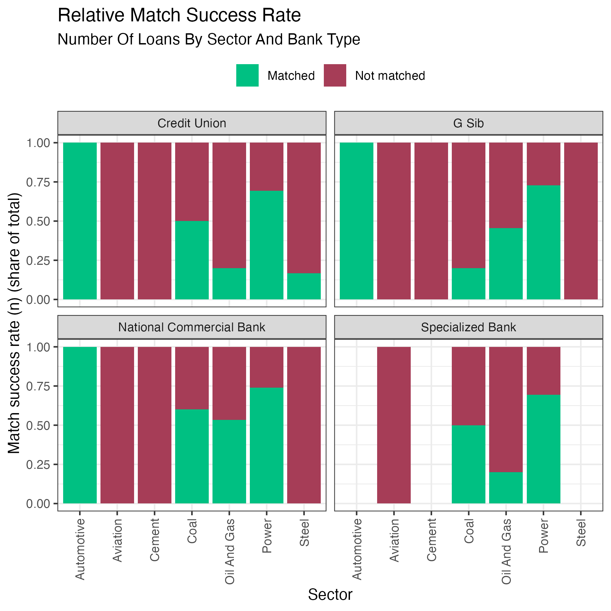
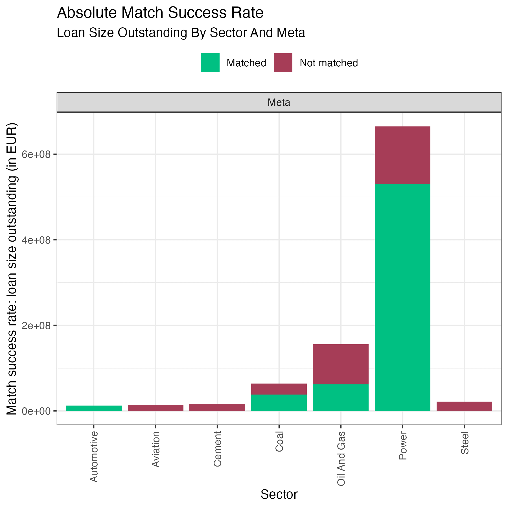
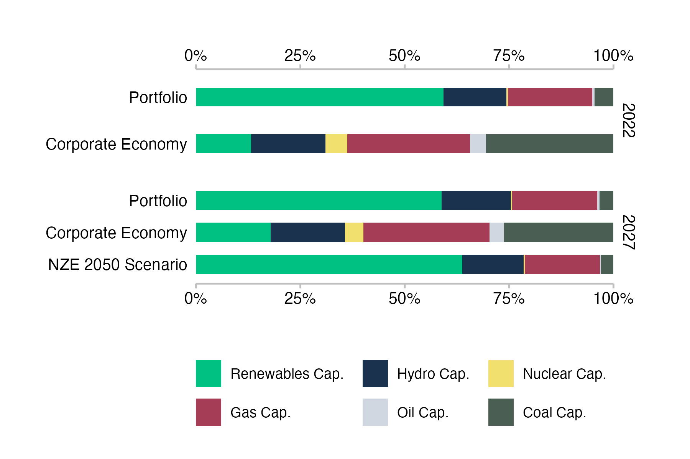
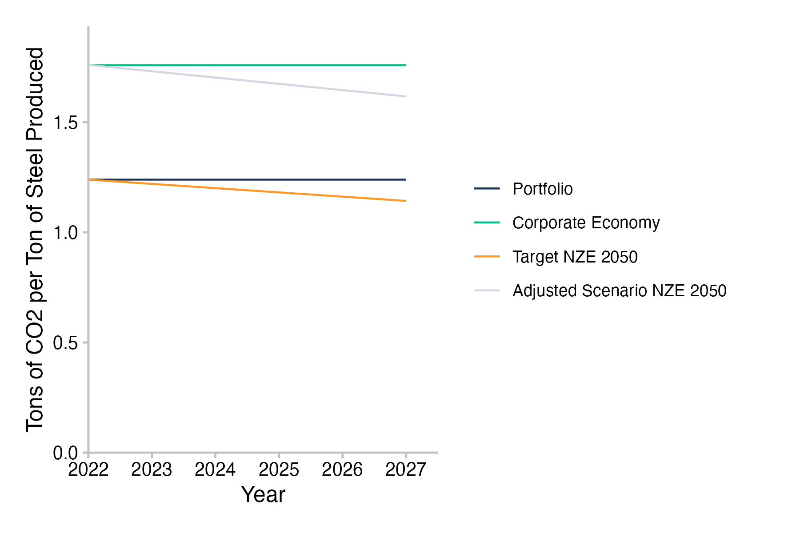

```{r, include = FALSE}
knitr::opts_chunk$set(
  collapse = TRUE,
  comment = "#>"
)
```

```{r setup, echo = FALSE}
library(pacta.multi.loanbook)

plot_table <- function(table) {
  table_plot <- gt::gt(dplyr::select(table, -"dataset"))
  
  table_plot <- 
    gt::cols_width(
      .data = table_plot,
      column ~ gt::px(150),
      typeof ~ gt::px(90)
    )
  
  table_plot <-
    gt::tab_style(
      data = table_plot,
      style = gt::cell_text(size = "smaller"),
      locations = gt::cells_body(columns = 1:2)
    )
  
  table_plot <-
    gt::tab_options(
      data = table_plot,
      ihtml.active = TRUE,
      ihtml.use_pagination = FALSE,
      ihtml.use_sorting = TRUE,
      ihtml.use_highlight = TRUE
    )
  
  gt::fmt_passthrough(table_plot)
}
```
# Interpretation of Results

Running the analysis will produce a number of outputs that can be used to gain insights into the alignment of financial institutions with climate transition scenarios and to approximate transition risk. The two main pieces of the analysis are the PACTA for Banks analysis and the net aggregate alignment metric. The PACTA for Banks analysis will provide insights into the alignment of the financial institution with the climate transition scenarios for each of the sectors covered by PACTA. The net aggregate alignment metric is intended be used as a high level overview alignment metric for the financial sector. The analyses thus complement each other where the net aggregate alignment metric can serve as a starting point to identify sectors or groups of financial institutions that seem to require particular attention. The PACTA for Banks analysis can then be used to drill down into the details of the alignment of the financial institution with the climate transition scenarios.

The following sections will provide an overview of results that are generated using this analysis and how to interpret them. It will briefly explain each of the relevant metrics, it will mention the plots that correspond to the metrics, and it will explain how the output data sets map to the values shown in the plots. The same will be provided for the coverage statistics that are generated for the analysis.

## Coverage Diagnostics

The coverage diagnostics include both a comparison of the number and value of matched loan books with the raw loan books and a comparison of the production capacity of companies in the matched loan books with the production capacity of companies in the wider economy. The coverage diagnostics are intended to provide insights into the quality of the matching process and the coverage of the loan books in the analysis.

### Match Success Rate

The match success rate is calculated per sector and can be calculated based on either of the number of loans, the outstanding value of the loans, or the credit limit of the loans. In either case, the sum value of the matched loans is compared with that of the raw loan books.

The output data set contains all three versions of the metric and can be found in the `../prioritized_loanbooks_and_diagnostics/lbk_match_success_rate<...>.csv` file, where <...> will be replaced with the name of the variable set in the by_group parameter.

#### Example Plots Match Success Rate

An example plot of the match success rate for the number of loans, in this case grouped by banks types (credit unions, less significant institutions and significant institutions), can look as follows:

```{r match_success_rate_n_rel, echo=FALSE, fig.cap='Fig. 2: Relative match success rate in number of loans by different bank types. Data is based on simulated test loan books.', fig.align='center', out.width='80%'}

```

```{r match_success_rate_n_abs, echo=FALSE, fig.cap='Fig. 3: Absolute match success rate in number of loans by different bank types. Data is based on simulated test loan books.', fig.align='center', out.width='80%'}
knitr::include_graphics("../man/figures/plot_match_success_rate_abs_n_bank_type.png")
```

Another example plot of the match success rate for the loan size outstanding, in this case an ungrouped meta view on the entire set of analyzed loan books, might look like this:

```{r match_success_rate_outstanding_rel, echo=FALSE, fig.cap='Fig. 4: Relative match success rate in number of loans aggregated over all loan books. Data is based on simulated test loan books.', fig.align='center', out.width='80%'}
knitr::include_graphics("../man/figures/plot_match_success_rate_rel_outstanding_meta.png")
```

```{r match_success_rate_outstanding_abs, echo=FALSE, fig.cap='Fig. 5: Absolute match success rate in number of loans aggregated over all loan books. Data is based on simulated test loan books.', fig.align='center', out.width='80%'}

```

#### Interpretation of the Match Success Rate

The match success rate is a coverage metric of properly identified loans relative to the raw input loan books. It is always provided by sector, because a company in the loan book can only be expected to be matched to the ABCD if it operates in the same sector. Since PACTA only covers a subset of economic sectors, judging the success of the matching process should only take into account the loans that fall within the scope of the PACTA analysis. Of course, the extent of exposure to these sectors may vary significantly between input loan books. But this has more to do with the strategy of the bank than with the quality of the matching process.

Generally, it is desirable to reach as high a match success rate as possible for each sector. It was mentioned before that the time spent to maximize the match success rate is at the discretion of the user. However, it is recommended to aim for a match success rate of more than 80% of the loan value within each sector that you are interested in. The steps to achieve this are described in the [section on the matching process](#matching-process).

If after following and concluding the matching procedure the match success rate is high for a given sector or the entire loan book, this indicates that you can draw conclusions from the PACTA analysis for the loan books with higher confidence. If it remains low for some sectors, this can point to one of several issues:

- There may be data quality issues in the raw loan book. For example, the company names may have been entered wrongly, or the sector classification may be incorrect. Problems with the sector classification may be corrected to some degree through desk research. However, there are limits to inferring sector codes like that and it is a time consuming process.
- There may be coverage issues in the ABCD. It is possible that all entries in the raw loan book are correct and the match success rate remains low, because the companies the loan book is exposed to are not covered in the ABCD. Since the ABCD is an externally sourced data set, there are two main approaches to tackling this. One is to reach out to the data provider and try to understand/add the missing data points. The other is to try and add the relevant data points manually based on your own data or research. This is a very involved process and not standard procedure and will therefore not be covered in this cookbook. Beyond those options, it is recommended to highlight coverage issues, if they cannot be fixed.

#### Data Dictionary Match Success Rate

The underlying data set used to generate these plots contains the following information:

```{r dd_lbk_match_success_rate_table, echo = FALSE}
table <- dplyr::filter(data_dictionary, .data[["dataset"]] == "lbk_match_success_rate")
plot_table(table)
```

#### Mapping the Data Dictionary to the Match Success Rate Plots

The variables in the table map to the figures as follows:

- `<by_group>:` The variable that the loan books are split by. This determines the number of panes in the plot. E.g. in figures 2 and 3, the loan books are split by bank type, generating one pane per type. In figures 4 and 5, the loan books are not split by any variable, generating a single pane for the entire set of loan books.
- `sector`: The match success rate is analysed by sector, with the sectors shown in separate columns. This is because a loan in the raw loan book can only be matched to the ABCD if the company operates in the sector covered by the ABCD. This highlights the importance of good data quality in the sector classification of the raw loan book. The target should be to have a sufficiently high match success rate for any sector that you want to make robust statements about.
- `match_n`: When showing the absolute number of loans matched (figure 3), this determines the size of the matched part of each column. 
- `total_n`: When showing the absolute number of loans matched (figure 3), this determines the total size (matched + unmatched) of each column.
- `match_success_rate_rel`: When showing the relative number of loans matched (figure 2), this determines the size of the matched part of each column.
- `match_outstanding`: When showing the absolute matched value of loans outstanding (figure 5), this determines the size of the matched part of each column. 
- `total_outstanding`: When showing the absolute matched value of loans outstanding (figure 5), this determines the total size (matched + unmatched) of each column.
- `match_success_outstanding_rel`: When showing the relative matched value of loans outstanding (figure 4), this determines the size of the matched part of each column.
- `match_credit_limit`: When showing the absolute matched credit limit of loans (not shown in figure), this determines the size of the matched part of each column. 
- `total_credit_limit`: When showing the absolute matched credit limit of loans (not shown in figure), this determines the total size (matched + unmatched) of each column.
- `match_success_credit_limit_rel`: When showing the relative matched credit limit of loans (not shown in figure), this determines the size of the matched part of each column.

### Loan Book Production Coverage

The loan book production coverage is calculated per sector and region (for all regions available in the given `scenario_source`). For a given combination of sector and region, it provides the total number of companies with operations in the sector and region in the wider economy. It then provides the number of matched companies in the loan book with operations in that sector and region. A ratio of the two values tells you the share of companies in the sector and region that you have identified in the matched loan book. Similarly, the data set provides the total production capacity of a sector in a region in the wider economy and the production by companies in the matched loan book in that sector and region. Notice that it only matters THAT the company was matched in the loan book, NOT how large the granted loan is. The ratio of the two values then tells us what percentage of the production capacity of a sector in a region the financial institution is involved in. Again, being involved in that production capacity is decidedly not a full responsibility, because many matched companies will likely have additional sources of funding. Lastly, the output provides the sum of the loan size outstanding to the matched companies in each of the sectors and regions.

The output data set can be found in the `../prioritized_loanbooks_and_diagnostics/summary_statistics_loanbook_coverage<...>.csv` file, where <...> will be replaced with the name of the variable set in the by_group parameter.

#### Interpretation of the Loan Book Production Coverage

The loan book production coverage is a coverage metric of the production capacity of companies in the loan book relative to the production capacity of companies in the wider economy. It is always provided by sector and region. Comparisons across sectors need to be separate, because of differing output units. And the coverage by region allows highlighting the regional focus of a bank for the given sector. The production coverage compares matched companies only, hence it depends on the quality of the matching process and any statements about the share of economic activity covered by the matched loan book should take this relationship into account.

Assuming a solid match success rate, the loan book production coverage tells you if the loan book is exposed to a large share of production capacity within a certain sector and region. This information can be relevant when assessing the impact of regional economic trends and policies that may affect the sector. For example, the loan book more susceptible to transition risk in one region than in another even when the introduced policies are very similar, because companies financed may operate a larger share of the production capacity in the first region.

#### Data Dictionary Loan Book Production Coverage

The data set contains the following information:

```{r dd_summary_statistics_loanbook_coverage_table, echo = FALSE}
table <- dplyr::filter(data_dictionary, .data[["dataset"]] == "summary_statistics_loanbook_coverage")
plot_table(table)
```

There is no standard plot that this package provides for visualizing the loan book production coverage.

## PACTA for Banks Outputs and Graphs

Below you will find a description of the standard PACTA for Banks data outputs and graphs. Some of the data outputs are intermediate files that do not directly map to a plot. These are only mentioned briefly. A detailed description can be found in the `vignette("data_dicationary")`. The plots are discussed in more detail, including the relevant table from the data dictionary and how the variables map to the plots.

### Target Market Share Results

The target market share results provide the intermediate format output required to generate the technology mix and volume trajectory plots. The output data set can be found in the `../analysis/standard/tms_results<...>.csv` file, where <...> will be replaced with the name of the variable set in the `by_group` parameter.

More information on the target market share results data set can be found in the [data dictionary](https://rmi-pacta.github.io/pacta.multi.loanbook/articles/data_dictionary.html#target-market-share-results-all-groups).

### Technology Mix

The technology mix metric compares the technology mix of the production capacity of companies in the loan book with that of the production capacity of companies in the wider economy and the scenario technology mix five years into the future. The output data set can be found in the `../analysis/standard/<...>/data_tech_mix_<sector>.csv` file, where <...> will be replaced with the names of each of the groups in the variable set in the `by_group` parameter. This means that the technology mix results always only show results for one group at a time.

The technology mix can only be calculated for sectors that have technology level scenario pathways. Generally, those tend to be sectors for which scalable low carbon alternatives exist. The technology mix can also be calculated for sectors in which all technologies are projected to phase down or out, but the results are less meaningful in those cases, as the technology mix cannot show the absolute requirements for a phasedown.

For a general explanation of the technology mix, see also the [PACTA for Investors website](https://pacta.rmi.org/pacta-for-investors/) under the "Metrics" tab.

#### Example Plots Technology Mix

This plot shows the technology mix for the automotive sector of a loan book. We can see that the exposure to automotive production of different engine types in the loan book shifts from 2022 to 2027. The exposure to electric vehicle production increases, while the exposure to internal combustion engine production decreases. A similar shift can be observed in the wider economy, although the shift starts from a smaller share in 2022, which implies the companies that are being financed have a relatively strong focus on electric vehicle production compared to the overall economy. We can also see what the technology mix looks like for the scenario in 2027. In this case, the shift of automotive production from internal combustion engines to electric vehicles in the portfolio exposure is not as strong as it ought to be to be in line with the scenario.

```{r tech_mix_auto, echo=FALSE, fig.cap='Fig. 6: Technology mix for the automotive sector of a loan book. Data is based on simulated test loan books.', fig.align='center', out.width='80%'}
knitr::include_graphics("../man/figures/plot_tech_mix_automotive_meta.png")
```

In another example of the technology mix plot for the power sector, we can again see a loan book that is exposed to a much higher share of low carbon technologies than the wider economy, mainly due to the large exposure to companies operating renewable energy power. The plot shows only a marginal shift for the loan book between 2022 and 2027, which means that the share of technologies does not quite align with the scenario values in 2027. However, we can again see that the loan book as far ahead of the wider economy in terms of low carbon technology exposure in the power sector, with nuclear power being the only notable exception of smaller exposure in the loan book.

```{r tech_mix_power, echo=FALSE, fig.cap='Fig. 7: Technology mix for the power generation sector of a loan book. Data is based on simulated test loan books.', fig.align='center', out.width='80%'}

```

#### Interpretation of the Technology Mix Plots

The technology mix plots show the exposure to underlying technologies by sector, where the technology mix of the financed companies is combined using the portfolio weight of each loan to generate the aggregate technology mix at the loan book level. This means that a technology mix at the company level reflects the underlying production of the company in terms of real economic output units, whereas the technology mix at the loan book level reflects the financial exposure of the bank to these technologies through its lending activities. As such, the overall size of the production activities of the underlying companies does not impact the technology mix of the loan book. It is a weighted average of relative production numbers. The technology mix at the loan book level therefore works better as a risk indicator than as a measure of impact.

For the corporate economy bars, the technology mix is based on the unweighted sum of underlying physical production capacity and for the scenario bar, the technology mix is based on the initial technology mix of the portfolio, extrapolated with required changes based on the market share approach that assumes all companies maintain their overall production shares in the sector.

#### Data Dictionary Technology Mix

The underlying data set used to generate the technology mix plots contains the following information:

```{r dd_data_tech_mix_table, echo = FALSE}
table <- dplyr::filter(data_dictionary, .data[["dataset"]] == "data_tech_mix")
plot_table(table)
```

#### Mapping the Data Dictionary to the Technology Mix Plots

The variables in the table map to the figures as follows:

- `<by_group>:` The variable that the loan books are split by. This determines the group for which the tech mix is shown. E.g. in case the aggregate loan book is displayed as in figures 6 and 7, the variable and value will be "meta". If the calculation had been grouped by `bank_type`, the resulting plots would have been returned for groups, such as credit unions, less significant institutions and significant institutions.
- `sector`: The PACTA sector that the technology mix is shown for.
- `technology`/`label_tech`: The technology represents the differences in product or fuel type (depending on the sector). Generally, some of the technologies within a sector are considered low carbon technologies and others are considered high carbon technologies. The technology mix shows the current distribution across these technologies and how that distribution may change. The `label_tech` is the same as the `technology`, but with a more human readable name to be displayed in the plot.
- `year`: The technology mix chart uses values from the start year of the analysis and contrasts them with values from the end year of the analysis, usually five years into the future.
- `metric`/`label`: The metric differentiates the types of bars shown in the technology mix plot. `projected` refers to the technology mix of the exposures in the loan book, `corporate_economy` represents the production technology mix of the real economy for the selected region and `target_<scenario>` refers to the technology mix the loan book would need to achieve five years into the future in order to be aligned with the scenario based on the market share approach. `<scenario>` stands for the selected target scenario as set in the `config.yml` file. The `label` is the same as the `metric`, but with a more human readable name to be displayed in the plot.
- `technology_share`/`value`: The actual value that determines the size of each of the technologies in the bars of the plot. The `technology_share` is the share of the technology in the total production capacity of the sector in the region. The `value` is the same as the `technology_share`, but formatted for display in the plot.

### Production Volume Trajectory

The production volume trajectory metric compares the future production capacity in a given technology of the companies in the loan book with that of the companies in the wider economy and the scenario trajectories for the loan book five years into the future, based on the market share approach. The output data set can be found in the `../analysis/standard/<...>/data_trajectory_<sector>_<technology>.csv` file, where <...> will be replaced with the names of each of the groups in the variable set in the `by_group` parameter. This means that the production volume trajectory results always only show results for one group at a time.

The production volume trajectory metric can only be calculated for sectors that have technology level scenario pathways. Generally, those tend to be sectors for which scalable low carbon alternatives exist, or sectors in which all technologies are projected to phase down or out.

For a general explanation of the production volume trajectory, see also the [PACTA for Investors website](https://pacta.rmi.org/pacta-for-investors/) under the "Metrics" tab.

#### Example Plots Production Volume Trajectory

In this example of the volume trajectory plot for electric vehicle production in the automotive sector, we can see that the exposure to electric vehicle production in the loan book is projected to increase from 2022 to 2027. Electric vehicle production in the real economy is projected to increase as well, but at a slower pace. The scenario trajectories for the IEA NZE by 2050 and IEA APS for the portfolio are also shown, based on the market share approach. The projection of the portfolio falls between the APS and the NZE by 2050 trajectories.

```{r trajectory_auto_ev, echo=FALSE, fig.cap='Fig. 8: Volume trajectory plot for electric vehicle production in the automotive sector of a loan book. Data is based on simulated test loan books.', fig.align='center', out.width='80%'}
knitr::include_graphics("../man/figures/plot_trajectory_automotive_electric_meta.png")
```

In another example of the production volume trajectory plot for the coal mining sector, we can see a loan book that reduces its exposed to coal mining activity over the time frame of the analysis. The real economy does so too, but again a t a slower pace. The scenario trajectories for the loan book based on the market share approach are plotted for the IEA STEPS, the IEA APS, and the IEA NZE by 2050 scenarios. The trend of the loan book projection follows the APS trajectory relatively closely over the examined time frame.

```{r trajectory_coal_mining, echo=FALSE, fig.cap='Fig. 9: Volume trajectory plot for for coal mining (technology and sector) of a loan book. Data is based on simulated test loan books.', fig.align='center', out.width='80%'}
knitr::include_graphics("../man/figures/plot_trajectory_coal_coal_meta.png")
```

#### Interpretation of the Production Volume Trajectory Plots

The production volume trajectory plots show the exposure of the loan book to production capacity trends of the financed companies for a given technology over the next five years, showing changes in percent relative to the start year. It contrasts this trend with the production trend of the real economy and with the trajectories that the loan book would have to finance in order to be aligned with scenarios based on the market share approach. The shading of the graph represents the direction of the required changes based on the scenario. If the green area is at the top of the graph, the technology needs to increase over time to align with the scenario. If the red area is at the top of the graph, the technology needs to decrease over time to align with the scenario. The required rates of change that apply for the individual loan book are determined using the market share approach, using the target market share ratio (TMSR) for high-carbon technologies and the sector market share percentage (SMSP) for low-carbon technologies. If the projected production trend of the loan book is equal or greater than the highest scenario line for an increasing technology, the loan book is aligned with the most ambitious scenario for that technology.

If it is below that scenario line, the loan book is misalgined with the most ambitious scenario for that technology. It may still be aligned with a less ambitious scenario. Likewise, if the projected production trend of the loan book is equal or lower than the lowest scenario line for a decreasing technology, the loan book is aligned with the most ambitious scenario for that technology. If it is above that scenario line, the loan book is misaligned with the most ambitious scenario for that technology. It may still be aligned with a less ambitious scenario.

For more information on how to calculate the TMSR and the SMSP, see the [PACTA for Banks documentation](https://rmi-pacta.github.io/r2dii.analysis/articles/target-market-share.html).

Also notice that alignment for one technology of a sector does not imply alignment of the entire sector. For example, building out electric vehicle production capacity in line with the IEA NZE by 2050 scenario does not say anything about the alignment of internal combustion engine production capacity. If ICE production does not decrease sufficiently fast, the sector as a whole will not be aligned. This would show both in the technology mix chart, where the slow decrease in ICE production would depress the share of EV production and in the production volume trajectory for the ICE production capacity.

#### Data Dictionary Production Volume Trajectory

The underlying data set used to generate the production volume trajectory plots contains the following information:

```{r dd_data_trajectory_table, echo = FALSE}
table <- dplyr::filter(data_dictionary, .data[["dataset"]] == "data_trajectory")
plot_table(table)
```

#### Mapping the Data Dictionary to the Production Volume Trajectory Plots

The variables in the table map to the figures as follows:

- `<by_group>:` The variable that the loan books are split by. This determines the group for which the production volume trajectory is shown. E.g. in case the aggregate loan book is displayed as in figures 8 and 9, the variable and value will be "meta". If the calculation had been grouped by `bank_type`, the resulting plots would have been returned for groups, such as credit unions, less significant institutions and significant institutions.
- `sector`: The PACTA sector that the production volume trajectory is shown for.
- `technology`: The technology within the `sector` that the production volume trajectory is shown for.
- `year`: The production volume trajectory displays annual rates of change of production volume relative to the start year, with the x-axis showing the years of the analysis.
- `scenario_source`: The scenario source that the production volume trajectory is shown for. This is the source set in the `config.yml` file. The scenario source determines the scenarios that are shown in the plot. Generally all scenarios available for the `sector` and `technology` are shown and they are represented by the lines that delineate the colored areas in the plot.
- `metric`/`label`: The metric differentiates the types of lines shown in the production volume trajectory plot. `projected` refers to the production volume trajectory of the exposures in the loan book, `corporate_economy` represents the production volume trajectory of the real economy for the selected region and `target_<scenario>` refers to the production volume trajectory the loan book would need to achieve five years into the future in order to be aligned with the scenario based on the market share approach. `<scenario>` will take all values of scenarios that are available for the `sector` and `technology` in the `scenario_ _source`. The `label` is the same as the `metric`, but with a more human readable name to be displayed in the plot.
- `percentage_of_initial_production_by_scope`/`value`: The actual value that determines the direction of the lines. The `percentage_of_initial_production_by_scope` is the percentage of the initial production volume that the production volume in the future represents. Hence, a positive value implies a build out of the underlying production capacity and a negative value stands for a decrease of production capacity. The `value` is the same as the `percentage_of_initial_production_by_scope`, but formatted for display in the plot.


### Sectoral Decarbonization Approach Results

The sectoral decarbonization approach (SDA) results provide the intermediate format output required to generate the emission intensity plot. The output data set can be found in the `../analysis/standard/sda_results<...>.csv` file, where <...> will be replaced with the name of the variable set in the `by_group` parameter.

More information on the SDA results data set can be found in the [data dictionary](https://rmi-pacta.github.io/pacta.multi.loanbook/articles/data_dictionary.html#sectoral-decarbonization-approach-results-all-groups).

### Emission Intensity Pathway

The emission intensity metric compares the future emission intensity per real economic output unit in a given sector of the companies in the loan book with that of the companies in the wider economy and the scenario trajectories for the loan book five years into the future, based on the SDA approach. The output data set can be found in the `../analysis/standard/<...>/data_emission_intensity_<sector>.csv` file, where <...> will be replaced with the names of each of the groups in the variable set in the `by_group` parameter. This means that the emission intensity results always only show results for one group at a time.

The emission intensity metric can be calculated for any sector that has sector level physical emission intensity pathways, defined as absolute emissions divided by absolute real economic output. This is usually available for a broader range of sectors than technology level pathways, including for the so called hard-to-abate sectors, where low carbon alternatives to the most commonly used production technologies are often not available yet, or at least not market ready.

As the emission intensity metric is compared to scenario values based on the SDA approach, the calculation of the scenario values for each portfolio follows different rules than the market share approach used in the technology mix and the production volume trajectory. The SDA approach is a convergence approach and does not necessarily require stable market share for all companies and/or loan books. Rather, it requires that all participants in a sector approach the same emission intensity target at the end year of the scenario. Notice that the end year of the scenario is usually much farther in the future than the five year forward looking horizon of the analysis, which is why the loan book value is not expected to have converged with the scenario value after five years.

For a general explanation of the emission intensity metric, see also the [PACTA for Investors website](https://pacta.rmi.org/pacta-for-investors/) under the "Metrics" tab.

#### Example Plots Emission Intensity Pathway

This example of the emission intensity pathway plot for cement production shows that the emission intensity of the companies the loan book is exposed to remain relatively stable at a higher level than that of the wider economy over the next five years. It also shows that both the target for the loan book based on the IEA NZE by 2050 scenario and the adjusted target for the wider economy based on the same scenario decrease over that time frame. The specific pathways of both these scenario trajectories converge in the end year of the scenario calculation - in this case 2050 - because they were calculated using a convergence approach, the SDA approach.

```{r emission_intensity_cement, echo=FALSE, fig.cap='Fig. 10: Emission intensity pathway plot for cement production of companies in the loan book. Data is based on simulated test loan books.', fig.align='center', out.width='80%'}
knitr::include_graphics("../man/figures/plot_emission_intensity_cement_meta.png")
```

In another example of the emission intensity pathway plot for the steel sector, we can see a loan book with an emission intensity based on its steel company exposure that is below the emission intensity of the real economy. Again, the trend of the emission intensity for both the companies in the loan book as well as the wider economy is rather stable and both would need to decrease over the next five years in order to be aligned with their respective scenario pathways, based on the SDA approach. This also again implies that the target scenario pathway of the loan book and the corporate economy converge in the end year of the scenario calculation.

```{r emission_intensity_steel, echo=FALSE, fig.cap='Fig. 11: Emission intensity pathway plot for steel production of companies in the loan book. Data is based on simulated test loan books.', fig.align='center', out.width='80%'}

```

#### Interpretation of the Emission Intensity Pathway Plots

The emission intensity pathway plots show the physical emission intensity trajectory of the portfolio weighted companies that the loan book is exposed to and contrast this with the physical emission intensity pathway of all companies in the relevant region of the real economy. Physical emission intensity in this case refers to the amount of CO2(eq) emissions per unit of real economic output from the sector at hand. Since the units of output are interchangeable per sector, but not across sectors, the physical emission intensity is a useful sector level metric. Since the emission intensity metric does not require technology level production pathways to be available, it can be used for sectors that do now have market-ready low carbon alternatives to replace high-carbon technologies yet. For the PACTA sectors, this is the case for the hard-to-abate sectors, such as cement, steel, and aviation. It can be applied to all other PACTA sectors as well though, although it may not be equally meaningful in all cases (for example, for a phaseout of coal mining, the emission intensity of coal mining may not be the most actionable metric).

The emission intensity of different loan books will vary within the same sector, depending on the companies that the loan books are exposed to. Accordingly, the effort required by each of the banks to align their loan books with the target scenario in that sector will differ as well. With the SDA approach being a convergence approach, any loan book with a higher than average emission intensity will be expected to follow a steeper decline in emission intensity than a loan book with a lower than average emission intensity. This is a necessary requirement of the convergence approach to scenario allocation. However, the initial level of the physical emission intensity of the loan book does not impact the alignment of the loan book. Whether or not alignment is achieved, depends solely on the rate of change of the emission intensity relative to the loan book specific decarbonization pathway.

For more information on how to calculate the SDA, see the [PACTA for Banks documentation](https://rmi-pacta.github.io/r2dii.analysis/articles/target-sda.html).

#### Data Dictionary Emission Intensity Pathway

The underlying data set used to generate the emission intensity pathway plots contains the following information:

```{r dd_data_emission_intensity_table, echo = FALSE}
table <- dplyr::filter(data_dictionary, .data[["dataset"]] == "data_emission_intensity")
plot_table(table)
```

#### Mapping the Data Dictionary to the Emission Intensity Pathway Plots

The variables in the table map to the figures as follows:

- `<by_group>:` The variable that the loan books are split by. This determines the group for which the emission intensity pathway is shown. E.g. in case the aggregate loan book is displayed as in figures 10 and 11, the variable and value will be "meta". If the calculation had been grouped by `bank_type`, the resulting plots would have been returned for groups, such as credit unions, less significant institutions and significant institutions.
- `sector`: The PACTA sector that the emission intensity pathway is shown for.
- `year`: The emission intensity pathway displays annual physical emission intensities, with the x-axis showing the years of the analysis.
- `scenario_source`: The scenario source that the emission intensity pathway is shown for. This is the source set in the `config.yml` file.
- `emission_factor_metric`/`label`: The metric differentiates the types of lines shown in the emission intensity pathway plot. `projected` refers to the emission intensity of the loan book based on its exposures to the underlying companies,  `corporate_economy` represents the emission intensity of the companies in the real economy, `target_<scenario>` refers to the emission intensity pathway the loan book would need to follow to remain aligned with the scenario based on the SDA approach, and `adjusted_scenario_<scenario>` is the emission intensity pathway the corporate economy in the sector would need to follow to remain aligned. `<scenario>` stands for the selected target scenario as set in the `config.yml` file. The `label` is the same as the `emission_factor_metric`, but with a more human readable name to be displayed in the plot.
- `emission_factor_value`: The actual value that determines the points that the emission intensity lines follow in the plot. The `emission_factor_value` is the ratio of emissions per real economic output unit.

## Net Aggregate Alignment Metric Outputs and Graphs

This section provides a description of the data outputs and graphs related to the Net Aggregate Alignment Metrics. Some of the data outputs are intermediate files that do not directly map to a plot. Such outputs are explained in detail in the `vignette("data_dictionary")`. The plots are discussed in more detail, including the relevant table from the data dictionary and how the variables map to the plots.

Please note that all plots in this section build on the Net Aggregate Alignment Metric, which is an aggregation of PACTA results for every sector that allows for a high level overview of sector alignment at the loan book level or higher. An intended use case is to use this metric first at the aggregate financial system level across all loan books and then drill down along different dimensions of interest. The idea behind this approach is to facilitate the comparison of many different banks and loan books using forward-looking production based alignment metrics without producing an excessive amount of plots and results that becomes hard to navigate and that may not reveal higher level patterns easily. The Net Aggregate Alignment Metric was first developed in the ECB Banking Supervision paper ["Risks from misalignment of banks’ financing with the EU climate objectives - Assessment of the alignment of the European banking sector"](https://www.bankingsupervision.europa.eu/ecb/pub/pdf/ssm.bankingsectoralignmentreport202401~49c6513e71.sl.pdf). For a detailed description of the methodology used in this implementation of the Net Aggregate Alignment Metric, see the two-part documentation of the metric, focusing on the starting with the [company level calculation of the net alignment metric](https://rmi-pacta.github.io/pacta.multi.loanbook/articles/company_alignment_metric.html) and proceeding with the approach to [aggregating the net alignment metric to the loan book level](https://rmi-pacta.github.io/pacta.multi.loanbook/articles/loanbook_aggregated_alignment_metric.html).

### Net Aggregate Alignment Metric - Sankey Plot

The net aggregate alignment sankey plot summarizes the financial exposure of a (grouped or ungrouped) loan book (left node) by financial exposure to PACTA sectors (middle node) and finally by whether or not the exposures are aligned based on the net aggregate alignment metric (right node). Alignment is defined as a binary variable, where any underlying exposure with an alignment metric greater or equal to 0 is considered aligned and any exposure with an alignment metric less than 0 is considered misaligned. The main purpose of this type of visualization is to provide an overview of system level alignment at one quick glance, at the expense of some detail that can be obtained from other plots. The output data set can be found in the `../analysis/aggregated/data_sankey_sector<...>.csv` file, where <...> will be replaced with the names of each of the groups in the variable set in the `by_group` parameter.

#### Example Plots Net Aggregate Alignment Metric - Sankey Plot

This example of the sankey plot looks at the aggregate financial exposure of all analyzed loan books (figure 12, left node). The middle node shows that a large share of the financial exposure can be found the in the power sector, with the automotive and oil & gas sectors also contributing significant chunks. Cement, coal and steel contribute minor parts to the overall financial exposure. The right node, in turn, shows how the sector exposure is distributed with regard to a binary alignment metric, based on the net aggregate alignment metric. Overall, green ribbons indicate the size of the aligned exposure, while red ribbons indicate the size of the misaligned exposure. We can see that aligned exposures make up a much smaller share of the overall exposure than misaligned exposures. The distribution of alignment/misalignment furthermore varies significantly between sectors, with half the exposure value in the oil & gas sector aligned, a much higher share than in any other of the sectors. The nature of this plot as a high level overview means that it does not show all the details. For example, the underlying companies are classified as aligned or misaligned in a binary manner. The net aggregate alignment metric is a continuous variable though, so the binary representation may skew the extent of alignment to some degree and should always be complemented with additional analyses from the following plots.

```{r sankey, echo=FALSE, fig.cap='Fig. 12: Sankey plot of the aggregated loan books by sector and by net aggregate alignment metric. Data is based on simulated test loan books.', fig.align='center', out.width='80%'}
knitr::include_graphics("../man/figures/plot_sankey_sector.png")
```

#### Interpretation of the Sankey Plot

The sankey plot emphasizes the distribution of the financial exposure of the analyzed loan books across sectors and aligned or misaligned counterparties. The plot necessitate categorical variables for the types of nodes, which means that the net aggregate alignment metric is transformed into a binary variable. The size of each group in a node along the y axis is the financial exposure to that group and that is the only continuous variable in this plot. In effect, the statements you can make based on this plot are along the lines of "XY USD of the financial exposure of the loan books is concentrated in the power sector. Among the exposure to power companies, the largest share goes to companies that are misaligned with the selected scenario". As we can see, this reveals more about howw much money is lent to how many companies that are misaligned ins oem form. It says nothing about how misaligned these companies are. They might all be very close to, but just behind, the scenario target. Or they might all be grossly off target. The reason why this is still a useful plot is because you get a very quick over view, in which sectors are the largest shares of your misaligned companies. This makes it easier to prioritize which company analytics to look at first. Additionally, you can validate the severity of the misalignment in a given sector, by inspecting the alignment-by-exposure plots, which will be explained next.

#### Data Dictionary Net Aggregate Alignment Metric - Sankey Plot

The underlying data set used to generate the net aggregate alignment sankey plot contains the following information:

```{r dd_data_sankey_table, echo = FALSE}
table <- dplyr::filter(data_dictionary, .data[["dataset"]] == "data_sankey")
plot_table(table)
```

#### Mapping the Data Dictionary to the Sankey Plot

The variables in the table map to the figures as follows:

- `<by_group>`: The variable that the loan books are split by. This corresponds to the leftmost node in the sankey plot and the values can either be all the same for the aggregate view on all analysed loan books or the values corresponding to each of the groups.
- `middle_node`: The PACTA sectors for which there is some financial exposure in the analyzed loan books.
- `is_aligned`: Binary variable that can have values "aligned" or "not aligned". All exposures that are aligned are represented as green ribbons, all those that are not aligned are red ribbons. The underlying net alignment metric refers to the five year forward-looking values in the final year of the analysis.
- `loan_size_outstanding`: The financial exposure of the loan books to the individual sectors and grouped by `ìs_aligned`. This is the continuous variable that determines the size of the ribbons in the plot along the y-axis.

### Net Aggregate Alignment by Financial Exposure

The net aggregate alignment by financial exposure plot summarizes the financial exposure (y-axis) of a (grouped or ungrouped) loan book (dot color) by financial exposure to PACTA sectors (x-axis). Every sector is shown in a separate pane with equal scales, which allows comparing the significance of exposures across sectors. In this plot, the net aggregate alignment metric is presented as a continuous variable along the y axis, which allows for more nuance compared with the sankey plot. Exposures to very misaligned companies will influence the loan book level alignment more negaatively here, because the loan book level net aggregate alignment metric is a weighted mean of the underlying continuous company level net aggregate alignments weighted by the financial exposure. However, this addittional detail makes the plot slightly slower to read than the sankey plot. Generally, this plot emphasizes the scale of the net aggregate alignment more than the exposure and is therefore a good complementary plot to the sankey plot. The output data set can be found in the `../analysis/aggregated/data_scatter_alignment_exposure<...>.csv` file, where <...> will be replaced with the names of each of the groups in the variable set in the `by_group` parameter.

#### Example Plots Alignment by Exposure

In this example plot, we analyse the net aggregate alignment by different bank types across six of the PACTA sectors. It is immediately obvious, that the exposures of credit unions in the oil & gas sector (misaligned) and in the power sector (aligned), as well as the exposures of less significant institutions in the coal sector (misaligned) have very pronounced net aggregate alignment metrics. This can be a further avenue for research into which specific companies seem to drive these results. It is also evident, that this plot does not make it very easy to compare the financial exposures across sectors, which highlights again one of the strengths of the sankey plot. Within sector however, financial exposure between groups can easily be differentiated.

```{r alignment_by_exposure, echo=FALSE, fig.cap='Fig. 13: Alignment by exposure plot of loan books grouped by bank type. Data is based on simulated test loan books.', fig.align='center', out.width='80%'}
knitr::include_graphics("../man/figures/plot_scatter_alignment_exposure_bank_type.png")
```

#### Interpretation of the Alignment by Exposure Plots

Generally, the alignment by exposure sector is very useful for interpretations of net alignment within sectors. Groups (e.g. bank types, but possibly other types of groups) further to the right of the x-axis have a larger financial exposure to companies in this sector than other groups. Dots higher on the y-axis indicate groups for which the loan book level net aggregate alignment is further ahead of the scenario than for groups with a dot lower on the y-axis. The 0 intercept on the y-axis means the weighted average net aggregate alignment of the group is right on target.

Of course, since the net aggregate alignment at loan book level is a weighted average of the underlying company level net aggregate alignments, a positive y-value does not mean that there are no misaligned companies to be found in the loan book for this sector. If individual company level alignment is of concern for your use case, you will have to check company level results to validate that. The most comprehensive output data set to inspect company level net alignment metrics is the `../analysis/aggregated/company_exposure_net_aggregate_alignment<...>.csv` file. Documentation for its contents can be found in [the relevant section of the data dictionary](https://rmi-pacta.github.io/pacta.multi.loanbook/articles/data_dictionary.html#company-net-aggregate-alignment-metric-with-financial-exposures).

#### Data Dictionary Alignment by Exposure

The underlying data set used to generate the net aggregate alignment by financial exposure plot contains the following information:

```{r dd_data_scatter_alignment_exposure_table, echo = FALSE}
table <- dplyr::filter(data_dictionary, .data[["dataset"]] == "data_scatter_alignment_exposure")
plot_table(table)
```

#### Mapping the Data Dictionary to the Alignment by Exposure Plots

The variables in the table map to the figures as follows:

- `<by_group>`: The variable that the loan books are split by. This corresponds to differently colored dots in each of the panes.
- `scenario`: The name of the scenario against which the net aggregate alignment is calculated. This is the scenario set in the `config.yml` file.
- `sector`: Each PACTA sector for which there is some exposure in the analysed loan books is shown in a separate pane.
- `year`: The net aggregate alignment metric is calculated for the end year of the analysis, that is, five year forward-looking.
- `exposure_weighted_net_alignment`: The y-axis value of the plot. This is the net aggregate alignment metric for the loan book, calculated as a weighted average of the underlying company level net aggregate alignment metrics. The weight is the financial exposure of the loan book to the companies in the sector.
- `sum_loan_size_outstanding`: The x-axis value of the plot. This is the financial exposure of the loan book to the companies in the sector.

### Buildout-Phaseout Scatter Plot for Aggregate Alignment Metric

The net aggregate alignment metric can be disaggregated into build out and phase out components for some sectors. Specifically those sectors, that have technology level pathways and both high carbon and low carbon technologies, can be disaggregated in this way. It may be insightful to analyze these components to understand better if any deviations from the scenario value are driven by too much or too little effort on either of the two sides. For example, in the automotive sector, this may reveal that almost all of the misalignment is due to a lack of phasing out high carbon technologies, while low carbon ones may be aligned in their build out. Similar patterns could be detected in the power sector. Such patterns can be understood as a prompt, which of the standard PACTA analyses may be most relevant to inspect for further drill down. The output data set is available both at the loan book level to compare the disaggregation by groups and at the company level to identify individual companies with strong drivers. The loan book level files can be found in the `../analysis/aggregated/data_scatter_sector<...>.csv` file, where <...> will be replaced with the names of each of the groups in the variable set in the `by_group` parameter. The company level files can be found in the `../analysis/aggregated/<...>/data_scatter_<sector>_company<...>.csv` file.

#### Example Plots Buildout-Phaseout Aggregate Alignment

This example plot shows the loan book level build out and phaseout disaggregation for three bank types. The y-axis shows that all three bank types have loan books with exposures to misalgined companies in terms of phaseout technologies. This means that high carbon technology production capacity is not decreasing fast enough in the loan books to align with the selected scenario. The build out side (x-axis) of the plot is more varied, with two of the bank types being aligned in terms of exposure to build out technologies and one being misaligned. The color of the dots indicates net alignment (the sum of the build out and phase out values). Only one of the three bank types has a positive net aggregate alignment value, which is indicated by the green hue and its position above the diagonal line. This is a case where the alignment in build out technologies outweighs the misalignment in phase out technologies.

```{r scatter_bo_po_loan_book, echo=FALSE, fig.cap='Fig. 14: Scatter plot showing the buildout/phaseout disaggregation of the net aggregate alignment metric in the automotive sector by bank type at the loan book level. Data is based on simulated test loan books.', fig.align='center', out.width='80%'}
knitr::include_graphics("../man/figures/plot_scatter_automotive_by_bank_type.png")
```

For a deeper dive into the company level disaggregation of the build out and phase out components, the following plot shows the same disaggregation for less significant financial institutions at the company level. The less significant institutions are the most misaligned dot in the previous loan book level chart. The plot shows that most of the companies the less significant institutions are exposed to in the automotive sector are firmly in the area of both misaligned build out and phase out technologies with only a few company exposures being closer to any positive alignment components. This means that the misalignment of the automotive sector for less significant financial institutions does not appear to be driven by few outliers, but seems to be rather consistent across exposures. 

```{r scatter_bo_po_company, echo=FALSE, fig.cap='Fig. 15: Scatter plot showing the buildout/phaseout disaggregation of the net aggregate alignment metric in the automotive sector for less significant fiancial institutions at the company level. Data is based on simulated test loan books.', fig.align='center', out.width='80%'}
knitr::include_graphics("../man/figures/plot_scatter_automotive_company_by_bank_type_less_significant.png")
```

#### Interpretation of the Buildout-Phaseout Scatter Plots for the Aggregate Alignment Metric

The buildout-phaseout scatter plots show the disaggregation of the net aggregate alignment metric into build out and phase out components. The x-axis shows the alignment of the loan book with the build out technologies of the sector, while the y-axis shows the alignment with the phase out technologies of the sector. The diagonal line from the top left to the bottom right of the plot indicates the threshold above which the sum of the build out and phase out components correspond to a positive net aggregate alignment value. The color of the dots indicates the net aggregate alignment of the loan book. Green dots indicate a positive net aggregate alignment, while red dots indicate a negative net aggregate alignment. The plot is also available at company level. If generated for loan books, one dot corresponds to one group of loan books, e.g. if there are three bank types, the aggregate loan books by bank types will be represented by three dots. It generated for companies, one dot corresponds to one company, where only companies are shown that have any exposure for the given `by_group`, e.g. if results are generated for `by_group = "bank_type"` and there are three bank types, then we will get three company level plots, each one containing only dots for companies that the corresponding bank type has an exposure to. The plot can be used to identify which of the two components of the net aggregate alignment metric is driving the alignment or misalignment of the loan book.

#### Data Dictionary Buildout-Phaseout Aggregate Alignment

The underlying data set used to generate the buildout-phaseout aggregate alignment scatter plot contains the following information:

```{r dd_data_scatter_sector_table, echo = FALSE}
table <- dplyr::filter(data_dictionary, .data[["dataset"]] == "data_scatter_sector")
plot_table(table)
```

#### Mapping the Data Dictionary to the Buildout-Phaseout Scatter Plot for the Aggregate Alignment Metric

The variables in the table map to the figures as follows:

- `name`: For loan book level plots: The names of the groups corresponding to the `by_group` value. For company level plots: The names of the companies that have exposures for the given group result.
- `buildout`: Net aggregate alignment metric for the build out component of the loan book or company. Maps to the x-axis. Aligned loan books or companies have a positive value, misaligned ones have a negative value.
- `phaseout`: Net aggregate alignment metric for the phase out component of the loan book or company. Maps to the y-axis. Aligned loan books or companies have a positive value, misaligned ones have a negative value.
- `net`: The net aggregate alignment metric of the loan book or company. Maps to the hue of the dot. Aligned loan books or companies have a positive value (green hue), misaligned ones have a negative value (red hue).
- `datapoint`: Indicates if the results are calculated at loan book or company level.

**PREVIOUS CHAPTER:** [3 - Running the Analysis](cookbook_running_the_analysis.html)

**NEXT CHAPTER:** [5 - Advanced Use Cases](cookbook_advanced_use_cases.html)
